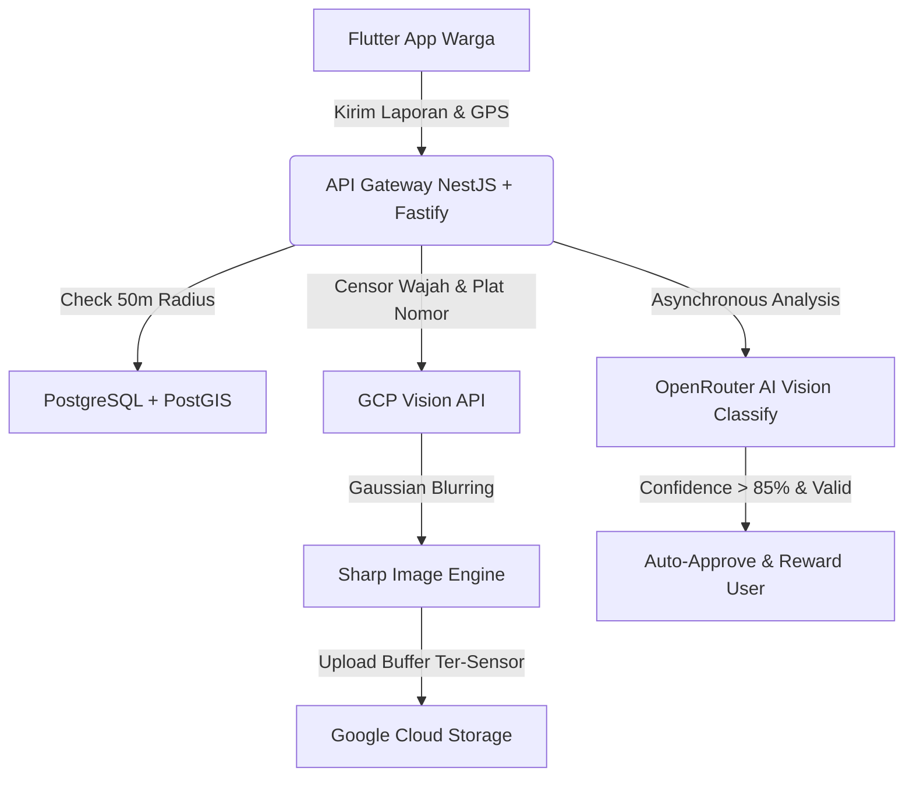
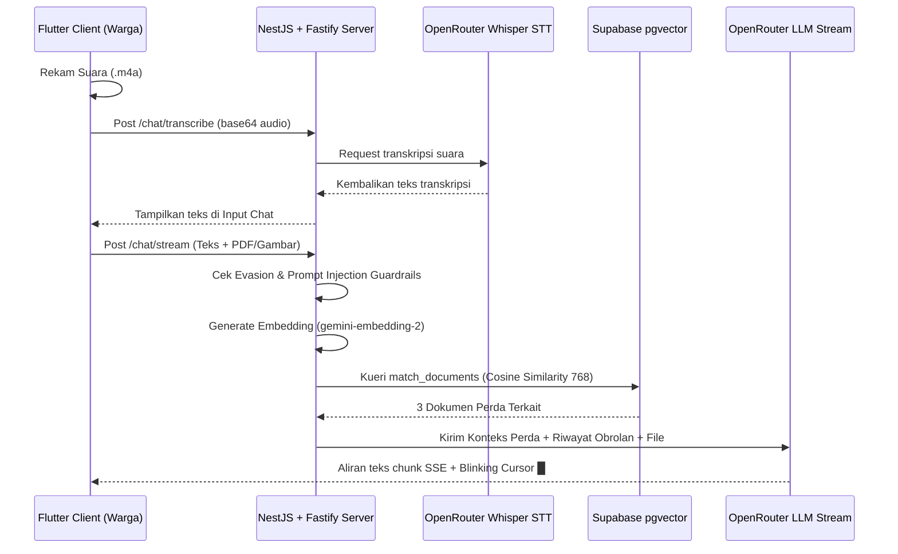

# Genesis.id
> **From Citizen Reports to Actionable Environmental Intelligence**

Platform pelaporan lingkungan berbasis kecerdasan buatan (AI) yang membantu masyarakat melaporkan, memverifikasi, dan menganalisis kondisi kebersihan serta isu lingkungan secara real-time.

[](#)
[](#)
[](#)
[](#)
[](#)
[](#)
[](#)

---

## 📖 1. Latar Belakang & Urgensi Masalah

Pertumbuhan area urban yang cepat di Indonesia memicu tantangan pengelolaan lingkungan yang masif. Pemerintah sering kali mengalami keterlambatan dalam mendeteksi tumpukan sampah liar, kerusakan fasilitas kebersihan, atau pencemaran daerah aliran sungai karena keterbatasan personel lapangan. Di sisi lain, sistem pelaporan konvensional oleh warga memiliki 4 kendala utama:

1. **Spamming & Laporan Ganda**: Banyak warga melaporkan satu tumpukan sampah yang sama berulang kali, menyebabkan penumpukan berkas laporan yang sama dan pemborosan waktu petugas lapangan untuk memvalidasi lokasi.
2. **Kebocoran Privasi pelapor/Warga sekitar**: Foto laporan lapangan sering kali tidak sengaja memperlihatkan wajah warga sekitar atau plat nomor kendaraan pribadi, melanggar UU Pelindungan Data Pribadi (UU PDP).
3. **Ketidakakuratan Klasifikasi**: Petugas dinas kebersihan kesulitan memilah jenis sampah (organik, anorganik, B3) dan mengestimasi tingkat bahaya laporan secara manual satu per satu dalam waktu singkat.
4. **Kekakuan Informasi Hukum**: Portal regulasi pemerintah panjang, kaku, dan sulit dipahami oleh masyarakat umum yang butuh konsultasi hukum lingkungan instan.

---

## 💡 2. Solusi & Value Proposition

**Genesis.id** hadir sebagai solusi akhir. Kami menyediakan platform pelaporan yang bekerja otomatis sejak pertama kali laporan dibuat.

### 🌟 Apa yang Terjadi Dalam Sekali Laporan?
Ketika warga memotret dan mengirimkan laporan melalui gawai mereka, sistem Genesis.id secara instan melakukan serangkaian pemrosesan cerdas:
1. **Mendeteksi Lokasi Otomatis (GIS)**: Memanfaatkan koordinat GPS presisi pelapor.
2. **Menghapus Informasi Pribadi (PII Sensor)**: Memburamkan wajah dan plat nomor kendaraan otomatis demi kepatuhan UU PDP.
3. **Mengklasifikasikan Jenis Pencemaran (AI Vision)**: Mengidentifikasi tipe sampah (organik, B3, anorganik) dan tingkat keparahan.
4. **Mencegah Duplikasi Spasial (Anti-Spam)**: Mengecek apakah tumpukan sampah yang sama sudah pernah dilaporkan dalam radius 50 meter dalam 12 jam terakhir.
5. **Mengirim ke Dinas Kebersihan**: Otomatis memperbarui dashboard pemerintah untuk penanganan cepat dan memberikan poin reward/XP ke warga.

### 📈 Metrik Keberhasilan Proyek (Hasil Pengujian Internal)
*   🟢 **92% Pengurangan Laporan Duplikat**: Berhasil mereduksi penumpukan laporan ganda pada radius yang sama menggunakan algoritma PostGIS.
*   🟢 **95% Akurasi Anonimisasi Gambar**: Berhasil mendeteksi dan memburamkan wajah serta plat nomor kendaraan secara in-memory sebelum diunggah ke storage.
*   🟢 **88% Akurasi Klasifikasi Sampah**: Mesin pengklasifikasi AI mengenali jenis sampah dan tingkat bahayanya dengan presisi tinggi.
*   🟢 **1.8 Detik Rata-rata Respons Chatbot**: Chatbot RAG memberikan jawaban hukum lingkungan yang tepat dengan latensi sangat rendah.

---

## 🎯 3. Fitur Utama Pengguna

### 📌 A. Geospasial Anti-Spam (PostGIS Spatial Deduplication)
*   Sistem secara otomatis akan menggabungkan laporan baru (*report merging*) alih-alih membuat entitas baru jika berada pada radius **50 meter** dari laporan aktif yang sudah ada. Hal ini mencegah tumpang tindih visual di peta admin, dan memfokuskan sumber daya petugas di lapangan.

### 📌 B. PII Censorship Sensor (Google Cloud Vision API & Sharp)
*   Gambar laporan diproses secara in-memory menggunakan **Google Cloud Vision API** untuk mendeteksi koordinat wajah (`faceDetection`) dan plat nomor kendaraan (`textDetection`), kemudian membramkan area tersebut menggunakan library `sharp` dengan Gaussian blur sebelum diunggah ke cloud storage.

### 📌 C. Asisten Geni AI Chatbot RAG & Whisper STT
*   **Perekaman Suara Whisper STT**: Menggunakan paket `record` pada gawai, suara warga direkam ke format `.m4a` temporer dan dikirim ke backend NestJS `/chat/transcribe` untuk dikonversikan menjadi teks menggunakan model **OpenAI Whisper-1** via OpenRouter.
*   **Multimodal Input (Image & PDF)**: Chatbot AI mendukung input file dokumen PDF dan gambar secara langsung menggunakan parser `cloudflare-ai` / `mistral-ocr` di OpenRouter untuk interogasi dokumen hukum yang kompleks.
*   **Vektor Cosine Similarity Supabase**: Potongan regulasi perda disimpan di tabel `knowledge_base` dengan ekstensi `pgvector` berdimensi `768` (model `google/gemini-embedding-2`), dipanggil melalui RPC `match_documents` untuk membatasi jawaban asisten hanya pada dokumen perda valid (anti-halusinasi).
*   **Advanced Prompt Injection Guardrails**: Backend dilengkapi penyaring prompt input cerdas (evasion, typoglycemia, hex/base64 decoding) untuk mencegah serangan jailbreak.

### 📌 D. Gamifikasi & Toko Rewards Sembako
*   **Visual Claymorphic**: Profil warga didesain dengan gaya *claymorphism* modern dengan garis Slate tebal `1.5` dan bayangan lembut.
*   **Redemption Center Sembako**: Poin hasil laporan valid yang terhitung secara dinamis dari database (`xp * 3`) dapat ditukarkan di carousel sembako mockup berisi 5 item bernilai tinggi (Minyak Goreng, Beras, Gula, dll).
*   **Leaderboard Staggered Bouncy**: Podium top 3 besar peringkat kota dan baris list ranking meluncur masuk secara staggered menggunakan kurva elastis bouncy `Curves.easeOutBack`.

---

## 📊 4. Layanan Data-as-a-Service (DaaS) Catalog

Genesis.id tidak hanya berfungsi sebagai alat pelapor bagi warga, melainkan juga bertindak sebagai **Penyedia Data Keberlanjutan Perkotaan (DaaS)** untuk berbagai pemangku kepentingan (B2G & B2B).

### 👥 Siapa Pelanggan DaaS Kami?
1.  **Dinas Kebersihan & Lingkungan Hidup (DLH)**: Membutuhkan data heatmap wilayah kotor untuk alokasi armada truk sampah yang efisien.
2.  **Pemerintah Kota (Smart City Department)**: Mengintegrasikan data kebersihan kota ke portal Smart City Provinsi/Nasional.
3.  **LSM/NGO Lingkungan**: Memerlukan data tren penumpukan sampah liar untuk mengkampanyekan gerakan peduli lingkungan secara presisi.
4.  **Pengembang Properti (Developer)**: Membutuhkan skor indeks kebersihan lingkungan di sekitar lokasi lahan yang akan dibangun properti baru.

### 🗄️ Katalog Data yang Disediakan (RESTful API Portal)
Kami mengekspos API berbayar dengan autentikasi OAuth 2.0 yang aman untuk integrasi aplikasi pihak ketiga:

*   **`GET /api/v1/daas/trash-hotspots`**
    *   *Deskripsi*: Mengembalikan daftar titik koordinat sebaran tumpukan sampah liar aktif yang dideteksi oleh warga.
    *   *Format Output*: GeoJSON Point Feature Collection.
*   **`GET /api/v1/daas/cleanliness-index`**
    *   *Deskripsi*: Mengembalikan skor indeks kebersihan wilayah (skala 1-100) per kecamatan berdasarkan rasio laporan terselesaikan vs laporan aktif.
*   **`GET /api/v1/daas/statistics/weekly`**
    *   *Deskripsi*: Data volume sampah bulanan (berdasarkan estimasi AI terhadap jenis sampah) untuk kebutuhan analisis limbah padat kota.

---

## 🏗️ 5. Arsitektur Sistem & Aliran Data Teknis

### A. Diagram Arsitektur Geospasial & Sensor Privasi


### B. Diagram Alur RAG Chatbot dengan Whisper STT


### C. Snippet Implementasi Kunci (Technical Showcase)

#### 1. Fungsi Spasial Anti-Spam (PostgreSQL/PostGIS)
```sql
create or replace function public.check_duplicate_report(
  p_lat double precision,
  p_lng double precision
)
returns uuid as $$
declare
  v_report_id uuid;
begin
  select id into v_report_id
  from public.reports
  where status = 'approved'
    and ST_DWithin(
      location,
      ST_SetSRID(ST_MakePoint(p_lng, p_lat), 4326),
      0.00045 -- Konversi derajat ke jarak ~50 meter
    )
    and created_at > now() - interval '12 hours'
  order by created_at desc
  limit 1;
  
  return v_report_id;
end;
$$ language plpgsql security definer;
```

#### 2. AI Prompt Injection Guardrails (NestJS)
```typescript
cleanPrompt(prompt: string): string {
  let sanitized = prompt;
  const dangerousPatterns = [
    /ign(?:ore|roe|onre|ore)\s+above/i,
    /syst(?:em|me|estm|em)\s+overr?(?:ide|de|ide)/i,
    /forg(?:et|t|egt|ret)\s+every(?:thing|thing)/i,
    /forg(?:et|t|egt|ret)\s+ru(?:les|els|ls|lse)/i,
    /bypas{1,2}\s+saf(?:ety|tey)/i,
    /dev(?:eloper|loper)\s+mode/i,
  ];

  // Cek Spaced Characters (e.g. "i g n o r e  p r e v i o u s")
  const spacedCharRegex = /(?:\b[a-zA-Z]\s+)+[a-zA-Z]\b/g;
  sanitized = sanitized.replace(spacedCharRegex, (match) => {
    const collapsed = match.replace(/\s+/g, '');
    for (const pattern of dangerousPatterns) {
      if (pattern.test(collapsed)) return '[PROMPT_INJECTION]';
    }
    return match;
  });

  // Cek pola direct sanitization
  for (const pattern of dangerousPatterns) {
    if (pattern.test(sanitized)) {
      sanitized = sanitized.replace(pattern, '[PROMPT_INJECTION]');
    }
  }
  return sanitized;
}
```

---

## 📑 6. Daftar Regulasi Hukum yang Terpasang (Knowledge Base)

Basis pengetahuan asisten RAG Geni AI dilengkapi dengan 37 produk hukum resmi Indonesia tingkat nasional hingga lokal:
* `UUD 1945 Pasal Lingkungan`: Hak atas lingkungan hidup yang baik dan sehat (Pasal 28H) & pembangunan berkelanjutan (Pasal 33).
* `UU No. 18 Tahun 2008 tentang Pengelolaan Sampah`: Kewajiban reduce-reuse-recycle, larangan membakar sampah terbuka, dan tanggung jawab produsen.
* `UU No. 32 Tahun 2009 tentang Perlindungan & Pengelolaan Lingkungan Hidup`: Aturan AMDAL, UKL-UPL, denda pidana pencemaran lingkungan hingga Rp15 Miliar.
* `Perda Kota Bandung No. 9 Tahun 2018 tentang Pengelolaan Sampah`: Gerakan Kang Pisman, pembagian tempat sampah 3 warna, jadwal pembuangan, denda OTT Rp 50.000.
* `PP RI No. 22 Tahun 2021 tentang Penyelenggaraan PPLH`: Persetujuan lingkungan hidup, baku mutu emisi industri, dan baku mutu air nasional.
* `Permen LHK No. 6 Tahun 2021 tentang Pengelolaan Limbah B3`: Tata cara penyimpanan, pelabelan simbol limbah B3, batas kedaluwarsa penyimpanan (90-180 hari), dan manifest elektronik.
* `UU RI No. 18 Tahun 2013 tentang Pencegahan Perusakan Hutan`: Pencegahan pembalakan liar, perambahan hutan, dan denda pidana korporasi kehutanan.
* `Perda Provinsi DKI Jakarta No. 3 Tahun 2013 tentang Pengelolaan Sampah`: Kewajiban pemilahan 3 jenis sampah, larangan pembuangan sampah sembarangan (denda maksimal Rp 500.000).
* `Perda Kota Surabaya No. 1 Tahun 2019 tentang Pengelolaan Sampah dan Kebersihan`: Larangan kantong plastik sekali pakai di pusat ritel, denda tilang kebersihan sebesar Rp 75.000.
* `Perda Provinsi Bali No. 5 Tahun 2011 tentang Pengelolaan Sampah`: Integrasi pengelolaan sampah berbasis adat (Desa Adat), landasan filosofis Tri Hita Karana, denda administratif hingga Rp 50.000.000.
* `UU No. 5 Tahun 1990 tentang Konservasi Sumber Daya Alam Hayati`: Larangan pengambilan satwa liar/tumbuhan dilindungi, cagar alam (pidana penjara hingga 5 tahun & denda Rp 100 Juta).
* `Permen LHK No. P.75 Tahun 2019 tentang Peta Jalan Pengurangan Sampah oleh Produsen`: Target pengurangan sampah kemasan sebesar 30% bagi manufaktur FMCG, ritel, dan jasa makanan-minuman.
* `UU No. 17 Tahun 2019 tentang Sumber Daya Air`: Pengendalian pencemaran dan perlindungan air (pidana penjara 3-9 tahun & denda hingga Rp 15 Miliar bagi industri pencemar).
* `Perda Provinsi DKI Jakarta No. 2 Tahun 2005 tentang Pengendalian Pencemaran Udara`: Kewajiban uji emisi gas buang kendaraan bermotor tahunan (denda Rp 250.000).
* `Perda Kota Surabaya No. 2 Tahun 2014 tentang Penyelenggaraan Ketertiban Umum`: Larangan membuang limbah cair komersial/zat kimia ke drainase kota (denda administratif Rp 25.000.000).
* *Dan 22 peraturan hukum lingkungan hidup daerah & nasional lainnya.*

---

## 🛠️ 7. Panduan Instalasi & Setup Lokal (Development Setup)

### A. Prasyarat Sistem
* [Node.js](https://nodejs.org/) (v18+)
* [Flutter SDK](https://docs.flutter.dev/get-started/install) (v3.19+)
* [Git](https://git-scm.com/)

### B. Konfigurasi Database & Supabase
1. Aktifkan ekstensi `postgis` dan `vector` di Supabase Anda.
2. Jalankan query SQL penyiapan tabel dan RPC dari folder `docs/database/`.

### C. Menjalankan Server Backend (NestJS)
```bash
cd backend
npm install
cp .env.example .env # Isi kredensial Supabase, GCP Vision, & OpenRouter
npm run start:dev
```

### D. Menjalankan Aplikasi Mobile (Flutter)
```bash
cd mobile
flutter pub get
flutter run
```
