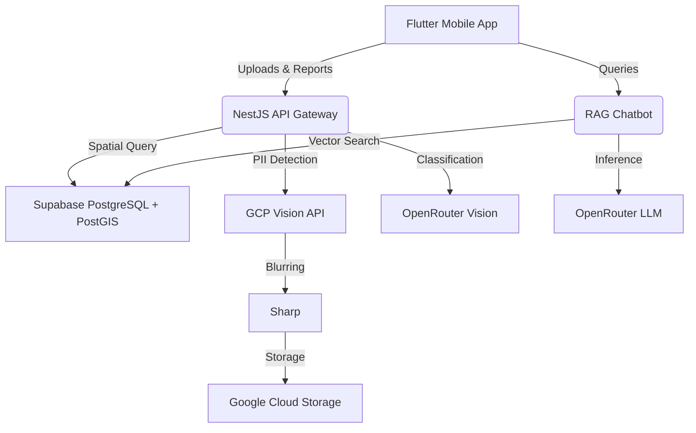

<div align="center">
  
</div>

<h1 align="center">Genesis</h1>

<div align="center">
  <p>AI-powered platform that encourages responsible waste management through computer vision, gamification, and environmental insights.</p>
</div>

<div align="center">
  <a href="#license">
    
  </a>
  <a href="#tech-stack">
    
  </a>
  <a href="#tech-stack">
    
  </a>
  <a href="#tech-stack">
    
  </a>
</div>

## Screenshots

<div align="center">
  
  
  
  
</div>

## Features

- **AI Waste Detection**: Automatically identifies waste types (organic, inorganic, hazardous) and assesses danger levels from uploaded photos.
- **Privacy Protection**: Blurs faces and vehicle license plates in images before storage using Cloud Vision and Sharp.
- **Spatial Deduplication**: Prevents spam by merging duplicate waste reports within a 50-meter radius using PostGIS.
- **Regulation Chatbot (Geni)**: RAG-based AI assistant that answers questions about local environmental regulations, supporting text and voice inputs.
- **Gamification System**: Awards users with XP, levels, and redeemable points for submitting valid environmental reports.
- **Data as a Service (DaaS)**: Provides REST API endpoints for municipal authorities to access trash hotspots and cleanliness indices.

## Architecture



## Installation

### Prerequisites
- Node.js (v18+)
- Flutter SDK (v3.19+)
- Supabase Project (PostgreSQL + pgvector)
- OpenRouter API Key
- Google Cloud Service Account (for Vision API)

### Backend Setup

```bash
git clone https://github.com/agissugandi7203-ops/EKKA-2026_MarhasAI.git
cd EKKA-2026_MarhasAI/backend

# Install dependencies
npm install

# Copy environment variables and configure them
cp .env.example .env

# Run development server
npm run start:dev
```

### Mobile Setup

```bash
cd ../mobile

# Install dependencies
flutter pub get

# Run the app
flutter run
```

## Project Structure

```text
Genesis/
├── backend/            # NestJS + Fastify REST API and RAG pipeline
├── docs/               # Detailed technical documentation and specifications
├── frontend/           # Next.js web application (Dashboard)
└── mobile/             # Flutter mobile application
```

## Tech Stack

- **Mobile**: Flutter, Dart, BLoC pattern, Dio
- **Backend**: NestJS, Fastify, TypeScript, Prisma
- **Database**: Supabase, PostgreSQL, PostGIS, pgvector
- **AI/ML**: OpenRouter (LLM, Vision, Whisper), Google Cloud Vision API

## Roadmap

- [x] AI waste classification
- [x] RAG chatbot for environmental laws
- [x] Gamification and reward system
- [x] PII image blurring
- [ ] Next.js administrative dashboard implementation
- [ ] Expanded DaaS endpoints for external integrations

## Contributing

Please refer to the `docs/` folder for detailed integration guides and clean code guidelines before submitting pull requests.

## License

This project is licensed under the MIT License.
