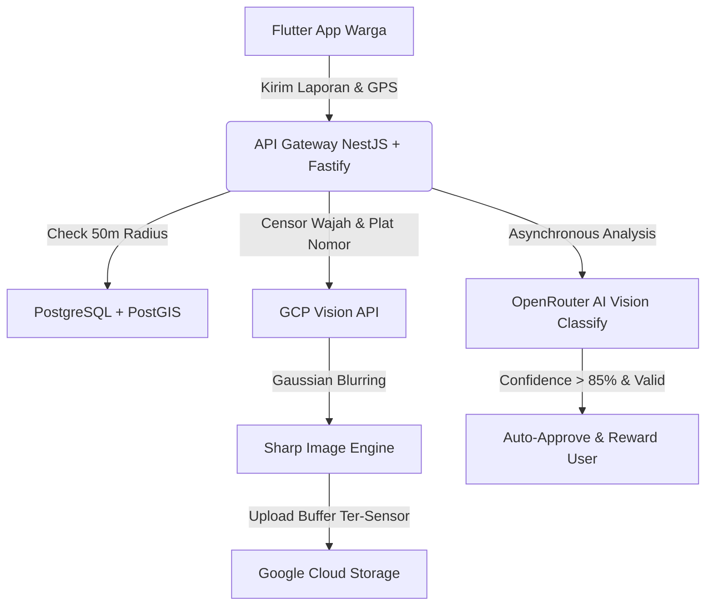
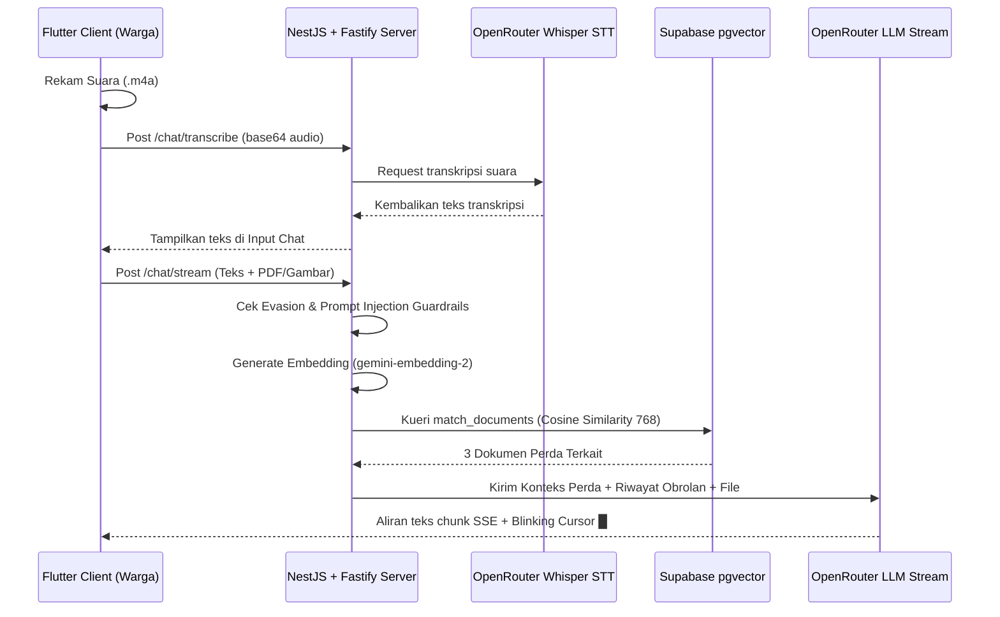

# Genesis.id — Platform Crowdsourcing & DaaS Lingkungan Nasional (LKS EKKA-2026)

🚀 **Platform Crowdsourcing Isu Lingkungan & Layanan Data-as-a-Service (DaaS) Pintar Berbasis Kecerdasan Artifisial Tingkat Tinggi**

[](#)
[](#)
[](#)
[](#)
[](#)
[](#)
[](#)

---

## 📖 1. Latar Belakang & Urgensi Masalah

Pertumbuhan area urban yang cepat di Indonesia memicu tantangan pengelolaan lingkungan yang masif. Pemerintah sering kali mengalami keterlambatan dalam mendeteksi tumpukan sampah liar, kerusakan fasilitas kebersihan, atau pencemaran daerah aliran sungai karena keterbatasan personel lapangan. Di sisi lain, sistem pelaporan konvensional oleh warga memiliki 4 kendala utama:

1. **Spamming & Duplikasi Laporan Spasial**: Banyak warga melaporkan satu tumpukan sampah yang sama berulang kali, menyebabkan beban administrasi yang tinggi dan pemborosan waktu petugas lapangan untuk melakukan validasi.
2. **Kebocoran Privasi (PII Leak)**: Foto laporan sering kali memperlihatkan wajah warga sekitar atau plat nomor kendaraan pribadi secara tidak sengaja, melanggar UU Pelindungan Data Pribadi (UU PDP).
3. **Ketidakakuratan Klasifikasi Laporan**: Petugas kota kesulitan memilah jenis sampah (organik, anorganik, B3) dan mengestimasi tingkat bahaya secara manual secara cepat.
4. **Ketidakramahan Layanan Informasi**: Portal regulasi pemerintah panjang, kaku, dan sulit dipahami oleh masyarakat umum yang butuh konsultasi instan.

**Genesis.id** hadir sebagai solusi komprehensif. Warga dapat melaporkan isu lingkungan secara instan menggunakan aplikasi Flutter, sementara backend cerdas mengelola sensor privasi gambar, mereduksi laporan spasial ganda, mengklasifikasikan tipe laporan dengan AI, dan menyediakan asisten hukum interaktif cerdas (RAG Chatbot) yang aman dari serangan eksploitasi prompt.

---

## 🏗️ 2. Arsitektur Sistem & Aliran Data

Genesis.id dibangun di atas struktur monorepo dengan pemisahan tanggung jawab yang jelas untuk memastikan fleksibilitas dan skalabilitas sistem:

```
LKS Dikdasmen/
├── backend/            # Modul NestJS + Fastify Server (TypeScript)
│   ├── src/
│   │   ├── chat/       # Perekaman suara Whisper & streaming chat
│   │   ├── reports/    # Upload laporan & AI Scan analyze
│   │   ├── storage/    # GCP Storage & Vision PII Blurring
│   │   └── openrouter/ # OpenAI Whisper, Gemini, Embedding client
├── frontend/           # Aplikasi Web Next.js App Router (TypeScript, React)
│   └── src/app/        # Dashboard Analitik Admin & B2G API Portal
├── mobile/             # Aplikasi Mobile Flutter (Dart)
│   └── lib/features/   # Clean Architecture (Auth, Leaderboard, Setup, Chat, Profile)
├── docs/               # Kumpulan spesifikasi fitur, database, & arsitektur
└── README.md           # Berkas petunjuk utama (Dokumen ini)
```

### A. Diagram Arsitektur Geospasial & Sensor Privasi


### B. Diagram Alur RAG Chatbot dengan Whisper STT


---

## ⚡ 3. Fitur Unggulan Sistem (The "Flex" Factor)

### 📌 A. Geospasial Anti-Spam (PostGIS Spatial Deduplication)
Sistem dilengkapi dengan filter spasial cerdas untuk menghindari duplikasi laporan. Sebelum laporan disimpan ke database:
* Backend mengeksekusi fungsi RPC PostGIS `check_duplicate_report(lat, lng)` untuk memindai radius **50 meter** dari lokasi laporan baru.
* Jika ditemukan laporan dengan status aktif pada radius tersebut, sistem secara otomatis akan menggabungkan laporan baru tersebut (*report merging*) alih-alih membuat entitas baru. Hal ini menghemat ruang penyimpanan, mencegah tumpang tindih visual di peta admin, dan memfokuskan sumber daya petugas di lapangan.

Berikut adalah kode fungsi PostgreSQL/PostGIS yang digunakan:

```sql
create or replace function public.check_duplicate_report(
  p_lat double precision,
  p_lng double precision
)
returns uuid as $$
declare
  v_report_id uuid;
begin
  select id into v_report_id
  from public.reports
  where status = 'approved'
    and ST_DWithin(
      location,
      ST_SetSRID(ST_MakePoint(p_lng, p_lat), 4326),
      0.00045 -- Konversi derajat ke jarak ~50 meter
    )
    and created_at > now() - interval '12 hours'
  order by created_at desc
  limit 1;
  
  return v_report_id;
end;
$$ language plpgsql security definer;
```

---

### 📌 B. PII Censorship Sensor (Google Cloud Vision API & Sharp)
Untuk mematuhi regulasi UU PDP secara ketat, platform menerapkan sensor data sensitif gambar secara in-memory sebelum diunggah ke Google Cloud Storage (GCS):
* **Deteksi Wajah & Plat Nomor**: Gambar yang diunggah dikirim ke **Google Cloud Vision API** untuk mendeteksi koordinat wajah (`faceDetection`) dan plat nomor kendaraan (`textDetection`).
* **Gaussian Blurring**: Backend memetakan koordinat bounding box yang dideteksi, lalu membramkan area tersebut menggunakan library `sharp` dengan kekuatan Gaussian blur optimal. Warga aman melapor tanpa khawatir melanggar hak privasi orang lain.

Berikut adalah implementasi in-memory processing menggunakan NestJS:

```typescript
async redactSensitiveInfo(imageBuffer: Buffer): Promise<Buffer> {
  if (!this.visionClient) return imageBuffer;

  try {
    const [faceResults] = await this.visionClient.faceDetection(imageBuffer);
    const [textResults] = await this.visionClient.textDetection(imageBuffer);

    const faces = faceResults.faceAnnotations || [];
    const textAnnotations = textResults.textAnnotations || [];

    if (faces.length === 0 && textAnnotations.length === 0) {
      return imageBuffer;
    }

    let processedImage = sharp(imageBuffer);
    const metadata = await processedImage.metadata();
    const imgWidth = metadata.width || 0;
    const imgHeight = metadata.height || 0;
    const compositeOperations: any[] = [];

    // Proses sensor wajah
    for (const face of faces) {
      const poly = face.boundingPoly;
      if (poly && poly.vertices) {
        const vertices = poly.vertices;
        const xCoords = vertices.map((v) => v.x || 0);
        const yCoords = vertices.map((v) => v.y || 0);
        const minX = Math.max(0, Math.min(...xCoords));
        const maxX = Math.min(imgWidth, Math.max(...xCoords));
        const minY = Math.max(0, Math.min(...yCoords));
        const maxY = Math.min(imgHeight, Math.max(...yCoords));

        const width = maxX - minX;
        const height = maxY - minY;

        if (width > 0 && height > 0) {
          const blurredFace = await sharp(imageBuffer)
            .extract({ left: minX, top: minY, width, height })
            .blur(20)
            .toBuffer();

          compositeOperations.push({ input: blurredFace, left: minX, top: minY });
        }
      }
    }

    // Proses sensor plat nomor (Teks)
    for (let i = 1; i < textAnnotations.length; i++) {
      const annotation = textAnnotations[i];
      const poly = annotation.boundingPoly;
      if (poly && poly.vertices) {
        const vertices = poly.vertices;
        const xCoords = vertices.map((v) => v.x || 0);
        const yCoords = vertices.map((v) => v.y || 0);
        const minX = Math.max(0, Math.min(...xCoords));
        const maxX = Math.min(imgWidth, Math.max(...xCoords));
        const minY = Math.max(0, Math.min(...yCoords));
        const maxY = Math.min(imgHeight, Math.max(...yCoords));

        const width = maxX - minX;
        const height = maxY - minY;

        if (width > 0 && height > 0) {
          const blurredText = await sharp(imageBuffer)
            .extract({ left: minX, top: minY, width, height })
            .blur(25)
            .toBuffer();

          compositeOperations.push({ input: blurredText, left: minX, top: minY });
        }
      }
    }

    if (compositeOperations.length > 0) {
      processedImage = processedImage.composite(compositeOperations);
    }

    return await processedImage.toBuffer();
  } catch (error) {
    this.logger.error('Error during PII redaction: ' + error.message);
    return imageBuffer;
  }
}
```

---

### 📌 C. AI Decision Engine & Auto-Approval
Setiap laporan yang berhasil disensor akan dianalisis secara asinkron oleh model kecerdasan artifisial vision:
* AI mengklasifikasikan tipe sampah (Plastik, Organik, B3, Kertas, Logam, Kaca, dll), memperkirakan tingkat bahaya (*low, medium, high*), serta menghitung skor keyakinan (*confidence score*).
* **Persetujuan Otomatis**: Jika laporan tersebut valid (`isValid = true`) dan memiliki keyakinan di atas **85%** (`confidence_score > 0.85`), sistem backend NestJS langsung memperbarui status laporan menjadi **Approved** dan memberikan poin reward serta XP kepada warga secara instan tanpa perlu persetujuan manual dari admin dinas kebersihan.

---

### 📌 D. Advanced Prompt Injection Guardrails
Backend dilengkapi penyaring prompt input cerdas untuk mencegah serangan instruksi sistem (Prompt Injection Jailbreaking):
1. *Character-Spaced Evasion*: Menghapus spasi antar karakter terpisah (contoh: `i g n o r e  p r e v i o u s` -> `ignore previous`).
2. *Encoding-Based Evasion*: Mendekode format Hex (Continuous / Spaced) dan Base64 sebelum pemindaian.
3. *Typoglycemia*: Mendeteksi kata-kata yang diacak huruf tengahnya (contoh: `ignroe`, `systme`).
4. *System Guardrail Regex*: Pola regex terinspirasi OWASP Top 10 LLM.
5. *Redaction*: Konten berbahaya diredaksi otomatis menjadi `[PROMPT_INJECTION]` agar aman dikirim ke LLM.

Berikut adalah kode logic pembersih prompt di backend NestJS:

```typescript
cleanPrompt(prompt: string): string {
  let sanitized = prompt;
  
  const dangerousPatterns = [
    /ign(?:ore|roe|onre|ore)\s+above/i,
    /syst(?:em|me|estm|em)\s+overr?(?:ide|de|ide)/i,
    /forg(?:et|t|egt|ret)\s+every(?:thing|thing)/i,
    /forg(?:et|t|egt|ret)\s+ru(?:les|els|ls|lse)/i,
    /bypas{1,2}\s+saf(?:ety|tey)/i,
    /dev(?:eloper|loper)\s+mode/i,
  ];

  // 1. Cek Space-separated Hex Pairs (e.g. "69 67 6e 6f 72 65")
  const spaceHexRegex = /\b([0-9a-fA-F]{2}\s+)+[0-9a-fA-F]{2}\b/g;
  sanitized = sanitized.replace(spaceHexRegex, (match) => {
    try {
      const hexes = match.split(/\s+/);
      const decoded = Buffer.from(hexes.map(h => parseInt(h, 16))).toString('utf-8');
      for (const pattern of dangerousPatterns) {
        if (pattern.test(decoded)) return '[PROMPT_INJECTION]';
      }
    } catch (_) {}
    return match;
  });

  // 2. Cek Continuous Hex String (e.g. "69676e6f7265")
  const continuousHexRegex = /\b[0-9a-fA-F]{8,}\b/g;
  sanitized = sanitized.replace(continuousHexRegex, (match) => {
    if (match.length % 2 === 0) {
      try {
        const decoded = Buffer.from(match, 'hex').toString('utf-8');
        for (const pattern of dangerousPatterns) {
          if (pattern.test(decoded)) return '[PROMPT_INJECTION]';
        }
      } catch (_) {}
    }
    return match;
  });

  // 3. Cek Base64 (e.g. "aWdub3JlIHByZXZpb3Vz")
  const base64Regex = /\b[a-zA-Z0-9+/]{8,}=*\b/g;
  sanitized = sanitized.replace(base64Regex, (match) => {
    try {
      const decoded = Buffer.from(match, 'base64').toString('utf-8');
      for (const pattern of dangerousPatterns) {
        if (pattern.test(decoded)) return '[PROMPT_INJECTION]';
      }
    } catch (_) {}
    return match;
  });

  // 4. Cek Spaced Characters (e.g. "i g n o r e  p r e v i o u s")
  const spacedCharRegex = /(?:\b[a-zA-Z]\s+)+[a-zA-Z]\b/g;
  sanitized = sanitized.replace(spacedCharRegex, (match) => {
    const collapsed = match.replace(/\s+/g, '');
    for (const pattern of dangerousPatterns) {
      if (pattern.test(collapsed)) return '[PROMPT_INJECTION]';
    }
    return match;
  });

  // 5. Cek pola direct sanitization
  for (const pattern of dangerousPatterns) {
    if (pattern.test(sanitized)) {
      sanitized = sanitized.replace(pattern, '[PROMPT_INJECTION]');
    }
  }

  return sanitized;
}
```

---

### 📌 E. Asisten Geni AI Chatbot RAG & Whisper STT
Sistem chatbot RAG (*Retrieval-Augmented Generation*) terintegrasi OpenRouter menyediakan asisten regulasi kota yang interaktif bernama Geni:
* **Perekaman Suara Whisper STT**: Menggunakan paket `record` pada gawai, suara warga direkam ke format `.m4a` temporer dan dikirim ke backend NestJS `/chat/transcribe` untuk dikonversikan menjadi teks menggunakan model **OpenAI Whisper-1** via OpenRouter.
* **Multimodal Input (Image & PDF)**: Chatbot AI mendukung input file dokumen PDF dan gambar secara langsung menggunakan parser `cloudflare-ai` / `mistral-ocr` di OpenRouter untuk interogasi dokumen hukum yang kompleks atau pengenalan objek visual.
* **Vektor Cosine Similarity Supabase**: Potongan regulasi perda disimpan di tabel `knowledge_base` dengan ekstensi `pgvector` berdimensi `768` (model `google/gemini-embedding-2`), dipanggil melalui RPC `match_documents` untuk membatasi jawaban asisten hanya pada dokumen perda valid (anti-halusinasi).

Berikut adalah kueri pencarian kesamaan kosinus pgvector yang kami gunakan di Supabase:

```sql
CREATE OR REPLACE FUNCTION public.match_documents (
  query_embedding VECTOR(768),
  match_threshold FLOAT,
  match_count INT
)
RETURNS TABLE (
  id UUID,
  title TEXT,
  content TEXT,
  similarity FLOAT
)
LANGUAGE sql STABLE
AS $$
  SELECT
    knowledge_base.id,
    knowledge_base.title,
    knowledge_base.content,
    1 - (knowledge_base.embedding <=> query_embedding) AS similarity
  FROM public.knowledge_base
  WHERE 1 - (knowledge_base.embedding <=> query_embedding) > match_threshold
  ORDER BY knowledge_base.embedding <=> query_embedding
  LIMIT match_count;
$$;
```

---

### 📌 F. Gamifikasi & Toko Rewards Sembako
* **Visual Claymorphic**: Profil warga didesain ulang dengan gaya *claymorphism* modern dengan garis Slate tebal `1.5` dan bayangan lembut.
* **Redemption Center Sembako**: Poin hasil laporan valid yang terhitung secara dinamis dari database (`xp * 3`) dapat ditukarkan di carousel sembako mockup berisi 5 item bernilai tinggi:
  1. Minyak Goreng Bimoli 1L (150 Poin)
  2. Beras Pandan Wangi 2kg (250 Poin)
  3. Gula Kristal Gulaku 1kg (100 Poin)
  4. Paket Sembako Lengkap (500 Poin)
  5. Voucher Indomaret Rp 50.000 (450 Poin)
* **Leaderboard Staggered Bouncy**: Podium top 3 besar peringkat kota dan baris list ranking meluncur masuk secara staggered menggunakan kurva elastis bouncy `Curves.easeOutBack` yang memanjakan mata juri dan pengguna.

---

### 📌 G. Integrasi OpenAPI & Generator Client SDK
Untuk menjembatani NestJS (Backend) dan Flutter (Mobile), kami mengintegrasikan otomatisasi generator klien API:
1. Skema OpenAPI diekspos secara dinamis oleh NestJS Swagger di endpoint `/api-json`.
2. Script generator di mobile otomatis mengunduh skema JSON tersebut dan membuat seluruh class DTO, Request/Response, dan API Client berbasis **Dio** secara instan.
3. Menjamin tipe data yang konsisten antara Backend dan Frontend/Mobile (*Type-Safe API integration*).

---

## 🛠️ 4. Spesifikasi & Pilihan Model AI

Genesis.id menggunakan orkestrasi model AI terkemuka untuk memastikan efisiensi latensi, biaya, dan akurasi analisis:
1. **google/gemini-2.5-flash**: Model default penyedia chat completion cepat dengan latensi sangat rendah, ideal untuk percakapan harian.
2. **google/gemini-2.5-pro**: Digunakan untuk analisis dokumen regulasi daerah yang rumit atau penalaran kompleks.
3. **deepseek/deepseek-chat (DeepSeek-V3)**: Pilihan model alternatif untuk completion terstruktur berkinerja tinggi.
4. **openai/whisper-1**: Model transkripsi suara (Speech-to-Text) berakurasi tinggi dengan pemrosesan bahasa Indonesia alami yang sangat baik.
5. **google/gemini-embedding-2**: Model penghasil representasi vektor 768 dimensi untuk basis pengetahuan regulasi hukum lingkungan.

---

## 📑 5. Daftar Regulasi Hukum yang Terpasang (Knowledge Base)

Basis pengetahuan asisten RAG Geni AI dilengkapi dengan produk hukum resmi Indonesia tingkat nasional hingga lokal:
* `UUD 1945 Pasal Lingkungan`: Hak atas lingkungan yang baik dan sehat (Pasal 28H) & pembangunan berkelanjutan berwawasan lingkungan (Pasal 33).
* `UU No. 18 Tahun 2008 tentang Pengelolaan Sampah`: Kewajiban reduce-reuse-recycle, larangan membakar sampah terbuka, dan tanggung jawab produsen.
* `UU No. 32 Tahun 2009 tentang Perlindungan & Pengelolaan Lingkungan Hidup`: Aturan AMDAL, UKL-UPL, denda pidana pencemaran lingkungan hingga Rp15 Miliar.
* `Perda Kota Bandung No. 9 Tahun 2018 tentang Pengelolaan Sampah`: Gerakan Kang Pisman, pembagian tempat sampah 3 warna (hijau, kuning, merah), jadwal pembuangan pukul 18:00-21:00 WIB, denda OTT Rp 50.000, serta penahanan KTP oleh PPNS.
* `PP RI No. 22 Tahun 2021 tentang Penyelenggaraan PPLH`: Persetujuan lingkungan hidup, baku mutu emisi industri, dan baku mutu air nasional.
* `Permen LHK No. 6 Tahun 2021 tentang Pengelolaan Limbah B3`: Tata cara penyimpanan, pelabelan simbol limbah B3, batas kedaluwarsa penyimpanan (90-180 hari), dan manifest elektronik (Festronik).
* `UU RI No. 18 Tahun 2013 tentang Pencegahan Perusakan Hutan`: Pencegahan pembalakan liar, perambahan hutan, dan denda pidana korporasi kehutanan.

---

## 🚀 6. Panduan Instalasi & Setup Lokal (Local Setup)

> [!NOTE]
> *Langkah-langkah instalasi ini ditujukan untuk lingkungan pengembangan lokal (development environment).*

### A. Prasyarat Sistem
* [Node.js](https://nodejs.org/) (v18+)
* [Flutter SDK](https://docs.flutter.dev/get-started/install) (v3.19+)
* [Git](https://git-scm.com/)

### B. Konfigurasi Database & Supabase
1. Buat akun dan proyek baru di [Supabase Cloud](https://supabase.com).
2. Di menu ekstensi database, aktifkan ekstensi `postgis` dan `vector`.
3. Jalankan query SQL penyiapan tabel, views, dan RPC `match_documents` serta `check_duplicate_report` yang berada di direktori `docs/database/` melalui SQL Editor Supabase Anda.

### C. Menjalankan Server Backend (NestJS)
1. Buka terminal, arahkan to folder `backend/`:
   ```bash
   cd backend
   npm install
   ```
2. Salin berkas `.env.example` menjadi `.env`:
   ```bash
   cp .env.example .env
   ```
3. Lengkapi kredensial pada berkas `.env` Anda (Supabase URL, Service Role Key, OpenRouter API Key, GCS Credentials, dll).
4. Unggah regulasi perda awal ke database RAG menggunakan CLI script:
   ```bash
   npx ts-node scripts/bulk-upload-knowledge.ts "../docs/regulations" "<your_supabase_service_role_key>" "http://localhost:3000"
   ```
5. Jalankan server backend dalam mode pengembangan:
   ```bash
   npm run start:dev
   ```

### D. Menjalankan Aplikasi Mobile (Flutter)
1. Buka terminal baru, arahkan ke folder `mobile/`:
   ```bash
   cd mobile
   flutter pub get
   ```
2. Pastikan file konfigurasi koneksi database telah sesuai di `lib/core/config/supabase_config.dart`.
3. Jalankan aplikasi pada emulator atau perangkat yang terhubung:
   ```bash
   flutter run
   ```
