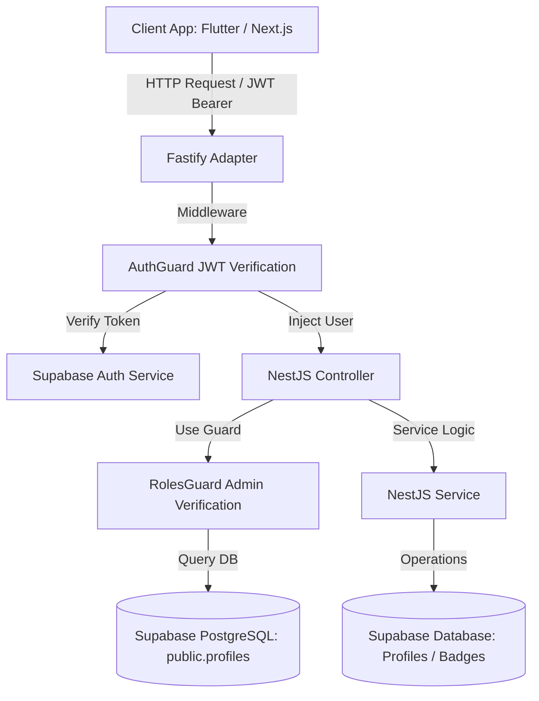

# Dokumentasi Arsitektur Backend Genesis.id (NestJS & Supabase)

Dokumen ini memuat detail arsitektur tingkat tinggi (*high-level architecture*), spesifikasi modul, penanganan otentikasi berbasis peran (RBAC), serta katalog API untuk backend **Genesis.id**. Berkas ini menjadi acuan utama pengembangan dan pemeliharaan backend.

---

## 1. Arsitektur Global & Alur Concurrency

Backend dibangun menggunakan **NestJS** dengan adapter **Fastify** untuk penanganan request throughput tinggi (mencapai ~45.000 req/detik). 



---

## 2. Struktur Modul & Penerapan Clean Code

Setiap modul diisolasi secara vertikal dengan prinsip **Separation of Concerns (SoC)** dan **Single Responsibility Principle (SRP)**:

### A. Modul Supabase (Pusat Data)
*   **SupabaseService**: Layanan global berbasis `@Injectable()` yang menginisialisasi `@supabase/supabase-js` menggunakan *Service Role Key* untuk memotong kebijakan Row Level Security (RLS) pada operasi yang diinisiasi oleh sistem (seperti penghapusan akun oleh admin).
*   **Boilerplate Modul**: Diekspos secara `@Global()` agar dapat disuntikkan (*dependency injection*) ke modul lain secara langsung.

### B. Modul Autentikasi & RBAC (Role-Based Access Control)
*   **AuthGuard** ([auth.guard.ts](file:///d:/PROJECT%20ARIEF/LKS%20Dikdasmen/backend/src/auth/auth.guard.ts)): Mengekstraksi Bearer Token dari request header, lalu melakukan verifikasi ke Supabase Auth (`supabase.auth.getUser(token)`). Menempelkan objek `user` dari Supabase ke `request.user`.
*   **RolesGuard** ([roles.guard.ts](file:///d:/PROJECT%20ARIEF/LKS%20Dikdasmen/backend/src/auth/roles.guard.ts)): Digunakan setelah `AuthGuard`. Guard ini mencocokkan `auth.uid` pengguna dengan kolom `role` di tabel `public.profiles`. Hanya mengizinkan akses jika role pengguna terdapat dalam anotasi dekorator `@Roles()`.
*   **Dekorator `@Roles()`** ([roles.decorator.ts](file:///d:/PROJECT%20ARIEF/LKS%20Dikdasmen/backend/src/auth/roles.decorator.ts)): Menyimpan metadata role yang diizinkan untuk diakses oleh handler tertentu.
*   **Dekorator `@GetUser()`** ([get-user.decorator.ts](file:///d:/PROJECT%20ARIEF/LKS%20Dikdasmen/backend/src/auth/get-user.decorator.ts)): Menyederhanakan injeksi data user terotentikasi langsung ke dalam parameter controller.

### C. Modul Profil (Profiles)
Mengatur pendaftaran wilayah pengguna (onboarding), detail gamifikasi, dan hak kontrol admin.
*   **OnboardProfileDto**: Skema validasi ketat menggunakan `class-validator` untuk memvalidasi data onboarding (username, nama lengkap, provinsi, kota terdaftar). Username divalidasi dengan ekspresi reguler `/^[a-zA-Z0-9_]+$/` (hanya huruf, angka, dan garis bawah).
*   **ProfilesService**:
    *   `getProfile(userId)`: Mengembalikan data profil lengkap yang di-JOIN dengan tabel `profile_badges` dan `badges` untuk mendapatkan lencana yang telah diraih.
    *   `onboard(userId, dto)`: Mengubah data lokasi dan username pengguna. Mencegah duplikasi username dengan pengecekan keunikan terlebih dahulu.
    *   `getAllProfiles()` *(Khusus Admin)*: Mengambil daftar seluruh profil terdaftar untuk monitoring lalu lintas admin.
    *   `deleteProfile(userId)` *(Khusus Admin)*: Menghapus akun pengguna dari database Supabase secara menyeluruh melalui API admin (`supabase.auth.admin.deleteUser()`). Tindakan ini akan memicu penghapusan cascade pada profil pengguna.

### D. Modul Leaderboard & Badges
*   **BadgesService**: `getAllBadges()` mengembalikan katalog lencana statis yang tersedia di database.
*   **LeaderboardService**:
    *   `getGlobalLeaderboard(limit)`: Membaca database view `global_leaderboard` secara real-time berdasarkan total XP pengguna.
    *   `getCityLeaderboard(limit)`: Membaca database view `city_leaderboard` untuk mendapatkan kontribusi XP per wilayah kota/kabupaten.

---

## 3. Spesifikasi Katalog API (API Contract)

Semua endpoint dilindungi oleh `AuthGuard` (membutuhkan header `Authorization: Bearer <token>`) kecuali ditentukan lain.

### A. Modul Autentikasi & Verifikasi
*   **GET `/auth/verify`**
    *   **Deskripsi**: Memverifikasi validitas token JWT dari klien.
    *   **Response (200 OK)**:
        ```json
        {
          "authenticated": true,
          "message": "Token authentication successful",
          "user": {
            "id": "uuid-string-user",
            "email": "user@example.com"
          }
        }
        ```

### B. Modul Profil & Onboarding
*   **GET `/profiles/me`**
    *   **Deskripsi**: Mengambil profil terperinci pengguna aktif beserta lencananya.
    *   **Response (200 OK)**:
        ```json
        {
          "id": "uuid-string",
          "username": "eko_warrior",
          "full_name": "Eko Susanto",
          "avatar_url": "https://example.com/avatar.jpg",
          "province": "Jawa Timur",
          "city_or_district": "Kota Surabaya",
          "xp": 350,
          "level": 1,
          "report_count": 3,
          "current_streak": 2,
          "last_report_date": "2026-06-20",
          "role": "citizen",
          "created_at": "2026-06-20T08:00:00.000Z",
          "updated_at": "2026-06-21T09:00:00.000Z",
          "badges": [
            {
              "earned_at": "2026-06-20T08:05:00.000Z",
              "id": "uuid-badge-1",
              "code": "first_report",
              "name": "Laporan Pertama",
              "description": "Berhasil mengunggah laporan pertama.",
              "icon_url": "https://example.com/badge1.png"
            }
          ]
        }
        ```

*   **POST `/profiles/onboard`**
    *   **Deskripsi**: Pengisian data profil & lokasi terdaftar pada login pertama kali.
    *   **Request Body**:
        ```json
        {
          "username": "eko_warrior",
          "full_name": "Eko Susanto",
          "province": "Jawa Timur",
          "city_or_district": "Kota Surabaya"
        }
        ```
    *   **Response (201 Created)**: Mengembalikan profil lengkap hasil update (seperti response `GET /profiles/me`).

*   **GET `/profiles`** *(Khusus Admin)*
    *   **Deskripsi**: Mengambil seluruh profil terdaftar di sistem.
    *   **Response (200 OK)**: Array of Profile Objects.

*   **DELETE `/profiles/:id`** *(Khusus Admin)*
    *   **Deskripsi**: Menghapus akun user beserta seluruh data profilnya secara permanen.
    *   **Response (200 OK)**:
        ```json
        {
          "success": true,
          "message": "User with ID uuid-string has been successfully deleted"
        }
        ```

*   **PATCH `/profiles/:id/gamification`** *(Khusus Admin)*
    *   **Deskripsi**: Mengoreksi atau menyesuaikan data gamifikasi pengguna secara manual.
    *   **Request Body**:
        ```json
        {
          "xp": 1200,
          "level": 2,
          "current_streak": 4
        }
        ```
    *   **Response (200 OK)**: Mengembalikan objek profil terperinci yang telah diperbarui.

### C. Modul Leaderboard & Badges
*   **GET `/badges`**
    *   **Deskripsi**: Mengambil katalog semua lencana yang terdaftar di database.
    *   **Response (200 OK)**: Array of Badges Objects.

*   **POST `/badges/award`** *(Khusus Admin)*
    *   **Deskripsi**: Memberikan lencana tertentu kepada pengguna secara manual.
    *   **Request Body**:
        ```json
        {
          "userId": "uuid-string-user",
          "badgeCode": "first_report"
        }
        ```
    *   **Response (201 Created)**:
        ```json
        {
          "success": true,
          "message": "Badge first_report awarded successfully"
        }
        ```

*   **DELETE `/badges/revoke`** *(Khusus Admin)*
    *   **Deskripsi**: Mencabut lencana tertentu dari pengguna secara manual.
    *   **Request Body**:
        ```json
        {
          "userId": "uuid-string-user",
          "badgeCode": "first_report"
        }
        ```
    *   **Response (200 OK)**:
        ```json
        {
          "success": true,
          "message": "Badge first_report revoked successfully"
        }
        ```

*   **GET `/leaderboard/global?limit=100`**
    *   **Deskripsi**: Mengambil papan peringkat pengguna secara global berdasarkan XP.
    *   **Response (200 OK)**: Array of User Leaderboard.

*   **GET `/leaderboard/city?limit=100`**
    *   **Deskripsi**: Mengambil papan peringkat Kabupaten/Kota terbersih berdasarkan kontribusi total XP warganya.
    *   **Response (200 OK)**: Array of City Leaderboard.
