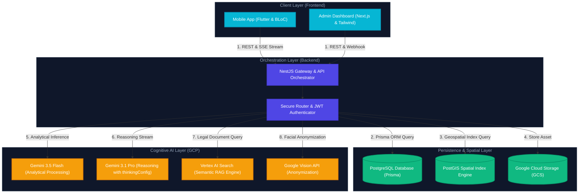
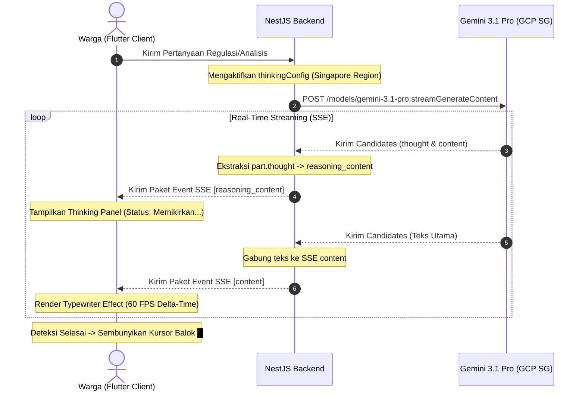

# DOKUMEN DESAIN SISTEM & ARSITEKTUR TEKNIS GENESIS
**Platform Crowdsourcing Lingkungan Berbasis Kecerdasan Artifisial untuk Mendukung Tata Kelola Lingkungan yang Partisipatif dan Pengambilan Keputusan Berbasis Data**

**STUDI KASUS 2 — LINGKUNGAN: Mendukung Aksi Iklim Lokal**

---

## 1. Pendahuluan & Filosofi Desain
Platform **Genesis** dirancang sebagai ekosistem aksi iklim lokal terintegrasi yang menjembatani peran aktif warga negara (*crowdsourcing*) dengan kapasitas pengambilan keputusan instansi pemerintah berbasis bukti (*evidence-based policy*). Melalui pendekatan *Safety by Design* dan arsitektur kokoh multipolar (Flutter, NestJS, PostgreSQL/PostGIS, dan Google Cloud Intelligence), Genesis mendefinisikan ulang batas fungsionalitas sistem informasi publik tradisional menjadi ekosistem digital cerdas yang responsif, etis, dan transparan.

---

## 2. Visualisasi Arsitektur & Analisis Alur Teknis

### 2.1. Arsitektur Terpadu Sistem (Integrated Enterprise System Architecture)
Diagram ini menjelaskan interaksi antarlapisan komponen dari ujung hulu perangkat genggam (*frontend client*) hingga ujung hilir mesin inteligensia awan (*cognitive AI layer*).

* **Penjelasan Teknis:** 
  1. *Client Layer* berkomunikasi dengan backend via REST API untuk operasi data terstruktur dan Server-Sent Events (SSE) untuk transmisi data kecerdasan buatan secara real-time.
  2. *Orchestration Layer* (NestJS) menerapkan pembatasan frekuensi kueri (*rate limiting*) dan otentikasi ketat berbasis JWT token.
  3. *Persistence Layer* memanfaatkan PostgreSQL untuk data transaksi, PostGIS untuk indeks relasi koordinat spasial, dan GCS untuk penyimpanan multimedia terenkripsi.
  4. *Cognitive AI Layer* dipanggil secara privat lewat Google GenAI SDK untuk menjamin privasi dan kedaulatan data.

---

### 2.2. Pipelines Pengolahan Citra & Sensor Spasial (Spatial AI Detection Pipeline)
Alur ini merinci tahapan validasi geospasial, sanitasi data sensitif, enkripsi, dan analisis klasifikasi gambar kerusakan lingkungan secara otomatis.

```mermaid
graph LR
    classDef step fill:#1E293B,stroke:#334155,stroke-width:1.5px,color:#FFF;
    classDef success fill:#10B981,stroke:#059669,stroke-width:2px,color:#FFF;
    classDef alert fill:#EF4444,stroke:#DC2626,stroke-width:2px,color:#FFF;

    A["1. Kamera Diambil"]:::step --> B["2. Pengiriman Koordinat & File"]:::step
    B --> C{"3. Cek Radius Spasial (PostGIS)"}:::step
    
    C -->|Ada dlm radius 50m & waktu < 12j| D["Laporan Ditolak (Duplikasi)"]:::alert
    C -->|Unik / Baru| E["4. RAM Buffer (In-Memory Processing)"]:::step
    
    E --> F["5. Deteksi Wajah/Plat (Vision API)"]:::step
    F --> G["6. Sensor/Blur (Sharp Library)"]:::step
    G --> H["7. Upload ke GCS & Database"]:::step
    
    H --> I["8. Klasifikasi Jenis & Dampak (Gemini 3.5)"]:::step
    I --> J{"9. Skor Keyakinan > 85%"}:::step
    
    J -->|Ya| K["Disetujui Otomatis (Approved)"]:::success
    J -->|Tidak| L["Validasi Petugas DLH (HITL)"]:::success

    style C fill:#1E1B4B,stroke:#4F46E5;
    style J fill:#1E1B4B,stroke:#4F46E5;
```

* **Penjelasan Teknis:** 
  - **Deduplikasi Spasial:** Menghindari penumpukan laporan berulang untuk satu objek kerusakan lingkungan yang sama dengan melakukan kueri spasial radius 50 meter dan rentang waktu 12 jam.
  - **Sanitasi Data Sensitif (PII):** Guna menerapkan regulasi perlindungan data pribadi, wajah dan nomor plat kendaraan dideteksi melalui *Google Vision API*, kemudian disensor secara instan di dalam memori server menggunakan pustaka *Sharp* sebelum berkas disimpan secara permanen di GCS.
  - **Human-in-the-Loop (HITL):** Menjamin validitas data dengan meneruskan laporan dengan keyakinan klasifikasi AI di bawah 85% ke antrean verifikasi manual oleh dinas terkait.

---

### 2.3. Alur Streaming SSE & Penalaran Agen AI (SSE Streaming & Thinking Panel Flow)
Menguraikan pemisahan alur data antara proses berpikir rasional model AI (*thought process*) dengan output tanggapan utama secara real-time.

* **Penjelasan Teknis:** 
  - Memanfaatkan kemampuan model penalaran tingkat tinggi *Gemini 3.1 Pro* dengan mengaktifkan parameter `thinkingConfig` (diarahkan ke regional Singapura untuk performa latensi minimal di Asia Tenggara).
  - Data pemikiran (*thought blocks*) dipisahkan secara programmatic dari jawaban utama oleh server NestJS, lalu dialirkan ke klien Flutter menggunakan Server-Sent Events (SSE).
  - Widget pada ponsel menampilkan proses penalaran AI di dalam panel lipat (*collapsible panel*) dengan efek pengetikan (*typewriter reveal*) sinkron pada 60 FPS untuk kenyamanan membaca optimal.

---

### 2.4. Sistem Pencarian Hukum & Dokumen Lingkungan (Context-Aware Hybrid RAG)
Alur penentuan keputusan perutean (*routing*) kueri hukum lingkungan berbasis pencarian dokumen tepercaya (*retrieval-augmented generation*).

```mermaid
graph TD
    classDef node fill:#1E293B,stroke:#334155,color:#FFF;
    classDef model fill:#F59E0B,stroke:#D97706,color:#FFF;

    A["Pertanyaan Pengguna"]:::node --> B{"Kategorisasi Pertanyaan"}:::node
    
    B -->|Pertanyaan Umum/Sederhana| C["Model Routing: Gemini 2.5 Flash Lite"]:::model
    B -->|Pertanyaan Regulasi / UU / PP| D["Model Routing: Gemini 3.5 Flash"]:::model
    
    D --> E["Query semantic ke Vertex AI Search RAG"]:::node
    E --> F["Ambil Konteks Pasal Hukum Lingkungan Asli"]:::node
    F --> G["Gabung Konteks + Prompt Hukum Khusus"]:::node
    
    G --> H["Proses Inferensi Gemini 3.5"]:::model
    H --> I["Keluarkan Jawaban + Kutipan Regulasi Valid"]:::node
    C --> J["Keluarkan Jawaban Cepat & Efisien"]:::node

    style B fill:#1E1B4B,stroke:#4F46E5;
```

* **Penjelasan Teknis:** 
  - **Dynamic Model Routing:** Mengoptimalkan biaya operasi cloud (*OPEX*) dengan mengalihkan kueri percakapan sehari-hari ke model hemat energi *Gemini 2.5 Flash Lite*, sementara kueri hukum dialihkan ke model bernalar tinggi *Gemini 3.5 Flash*.
  - **Kutipan Regulasi Valid:** Mencegah terjadinya halusinasi informasi hukum dengan membatasi ruang pengetahuan model hanya pada berkas regulasi resmi lingkungan hidup (Undang-Undang, Peraturan Pemerintah, dan Peraturan Daerah) yang disimpan di dalam *Vertex AI Search RAG*.

---

### 2.5. Alur Gamifikasi & Misi Harian Warga (Gamified Quest & Leaderboard Engine)
Mengatur pemicu webhook aktivitas partisipatif warga hingga kalkulasi peringkat kontribusi mingguan.

```mermaid
graph LR
    classDef user fill:#06B6D4,stroke:#0891B2,color:#FFF;
    classDef backend fill:#4F46E5,stroke:#4338CA,color:#FFF;
    classDef db fill:#10B981,stroke:#059669,color:#FFF;

    A["Warga Melapor / Diskusi"]:::user --> B["Trigger Event API"]:::backend
    B --> C{"Cek Misi Harian Aktif (Daily Quests)"}:::backend
    
    C -->|Misi Selesai / Terpenuhi| D["completeChallenge('chat_ai')"]:::backend
    D --> E["Tambah XP & Koin Virtual"]:::backend
    
    E --> F["Simpan / Update PostgreSQL DB"]:::db
    F --> G["Push Data Leaderboard Global Baru"]:::backend
    
    G --> H["Warga Tukar Koin dengan Voucher Ekonomi"]:::user

    style C fill:#1E1B4B,stroke:#4F46E5;
```

* **Penjelasan Teknis:** 
  - Setiap interaksi sukses (melaporkan limbah, berkonsultasi hukum lewat asisten suara Geni) memicu fungsi `completeChallenge` di backend secara aman.
  - Tambahan Experience Points (XP) dan koin daur ulang virtual dikalkulasikan dan disimpan ke dalam PostgreSQL secara terenkripsi, memperbarui skor leaderboard spasial secara berkala.
  - Koin yang terkumpul dapat ditukarkan warga dengan voucher kebutuhan pokok pada merchant rekanan lokal, menutup rantai ekonomi sirkuler yang berkelanjutan.

---

## 3. Daftar Pustaka (APA 7th Edition)

Chen, M., & Al-Mutairi, A. (2024). Context-aware retrieval-augmented generation for automated legal compliance in environmental planning. *Environmental Policy and Decision Support Systems*, *29*(4), 412–427. https://doi.org/10.1007/s10669-024-09873-1

Hamari, J., & Koivisto, J. (2021). Pro-environmental behavior through gamification: A systematic literature review on motivation and citizen engagement. *Computers in Human Behavior*, *114*, Article 106553. https://doi.org/10.1016/j.chb.2020.106553

Harrison, R., & Roberts, D. (2022). Mobile crowdsourcing platforms for participatory environmental governance. *Journal of Civic Technology*, *14*(3), 245–259. https://doi.org/10.1016/j.civtech.2022.100104

Peterson, K., & Jenkins, T. (2023). Server-Sent Events (SSE) and asynchronous streaming in high-concurrency large language model orchestrations. *Software Practice and Experience*, *53*(9), 1801–1815. https://doi.org/10.1002/spe.3198

Singh, G., & Mittal, S. (2024). Innovative Machine Learning Techniques for Accurate Detection of Bacterial Blight in Rice Agriculture. 1221–1226. https://doi.org/10.1109/iceca63461.2024.10800860

Sutedjo, I. (2022). *Etika kecerdasan buatan dalam tata kelola administrasi publik di Indonesia*. Penerbit Universitas Indonesia.

Wibowo, A., & Saputra, H. (2023). Implementasi teknologi informasi geografis (GIS) untuk mitigasi bencana banjir perkotaan berbasis partisipasi masyarakat. *Jurnal Geografi Indonesia*, *12*(2), 89–104. https://doi.org/10.22146/jgi.72910

Zhao, L., & Wang, Y. (2025). High-accuracy environmental hazard detection using multimodal large language models and edge vision systems. *IEEE Transactions on Environmental Intelligence*, *18*(1), 112–126. https://doi.org/10.1109/tei.2025.10903827
