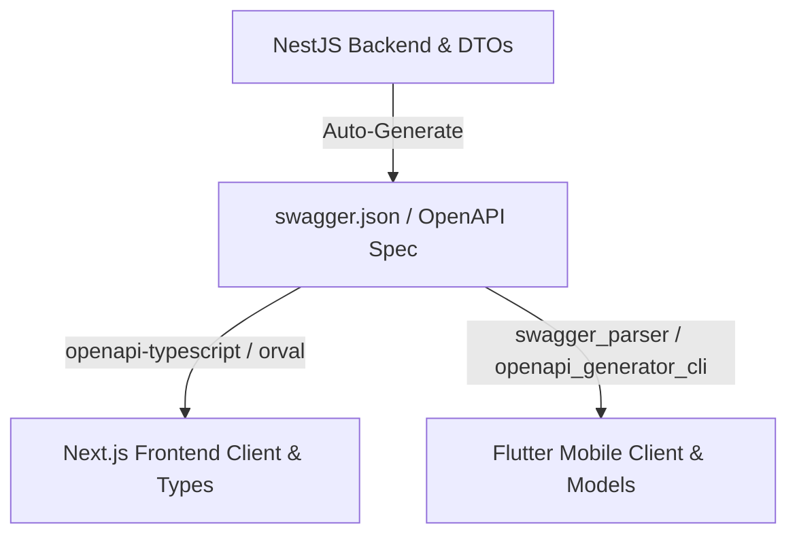

# Integration Guide: Backend, Frontend, and Mobile

Dokumen ini menjelaskan strategi integrasi otomatis antara Backend (NestJS), Frontend (Next.js), dan Mobile (Flutter) menggunakan spesifikasi **OpenAPI (Swagger)**. Strategi ini menghilangkan kebutuhan menulis API client secara manual dan menjaga tipe data tetap sinkron di semua platform.

---

## 1. Konsep Alur Integrasi (API-First / Contract-First)



Dengan alur ini:
- Backend menulis API beserta skema DTO (Data Transfer Object) menggunakan dekorator Swagger.
- Ketika backend dijalankan, spesifikasi API lengkap di-generate dalam bentuk file JSON/YAML.
- Frontend dan Mobile men-generate kode pemanggilan API beserta model data berdasarkan spesifikasi tersebut.

---

## 2. Setup OpenAPI di NestJS (Backend)

1. Pasang dependensi Swagger di direktori `backend/`:
   ```bash
   npm install --save @nestjs/swagger
   ```
2. Konfigurasikan Swagger di `backend/src/main.ts`:
   ```typescript
   import { SwaggerModule, DocumentBuilder } from '@nestjs/swagger';
   import * as fs from 'fs';

   async function bootstrap() {
     const app = await NestFactory.create(AppModule);

     const config = new DocumentBuilder()
       .setTitle('LKS Dikdasmen API')
       .setDescription('Dokumentasi API LKS Dikdasmen')
       .setVersion('1.0')
       .addBearerAuth()
       .build();
     const document = SwaggerModule.createDocument(app, config);
     SwaggerModule.setup('api/docs', app, document);

     // Opsional: Simpan skema ke file untuk digunakan frontend/mobile secara offline
     fs.writeFileSync('../docs/swagger.json', JSON.stringify(document, null, 2));

     await app.listen(3000);
   }
   bootstrap();
   ```
3. Gunakan dekorator `@ApiProperty()` di DTO Anda agar properti data masuk ke dalam skema OpenAPI.

---

## 3. Setup Generator di Next.js (Frontend)

Untuk mendapatkan tipe data TypeScript otomatis tanpa menulis manual:
1. Pasang tool generator di direktori `frontend/`:
   ```bash
   npm install -D openapi-typescript
   ```
2. Tambahkan script di `frontend/package.json`:
   ```json
   "scripts": {
     "generate-api": "openapi-typescript ../docs/swagger.json -o ./src/features/api/schema.d.ts"
   }
   ```
3. Jalankan `npm run generate-api`. Anda akan mendapatkan file `schema.d.ts` yang berisi definisi interface TypeScript dari backend secara instan.
4. Anda bisa memadukannya dengan pustaka Fetching seperti `Fetch` bawaan atau Axios yang di-typecast dengan tipe dari `schema.d.ts`, atau menggunakan generator klien seperti `orval` untuk menghasilkan Hook React Query otomatis.

---

## 4. Setup Generator di Flutter (Mobile)

Untuk men-generate model Dart dan Service API secara otomatis:
1. Pilihan terbaik untuk Flutter saat ini adalah menggunakan package `swagger_parser`. Tambahkan ke `mobile/pubspec.yaml`:
   ```yaml
   dev_dependencies:
     build_runner: ^2.4.0
     swagger_parser: ^2.8.0
   ```
2. Buat konfigurasi generator `swagger_parser.yaml` di root direktori `mobile/`:
   ```yaml
   swagger_parser:
     schema_path: ../docs/swagger.json
     output_directory: lib/core/network/api
     language: dart
     client_postfix: Client
     squish_clients: true
   ```
3. Jalankan perintah generator di direktori `mobile/`:
   ```bash
   dart run swagger_parser:generate
   ```
4. Perintah di atas akan menghasilkan seluruh Dart Models (lengkap dengan serialisasi `fromJson` dan `toJson`) serta service API HTTP client menggunakan Dio atau HTTP client bawaan.

---

## 5. Keuntungan Utama Pendekatan Ini
- **Keamanan Tipe Data (Type Safety)**: Jika backend mengubah field `userId` menjadi `id`, proses build di Next.js dan Flutter akan gagal (error compile), sehingga bug dapat segera diperbaiki sebelum deployment.
- **Efisiensi Waktu**: Tidak perlu menulis ulang kode model, tipe data request-response, dan pemanggilan HTTP di 3 tempat yang berbeda.
- **Dokumentasi yang Selalu Up-to-date**: Halaman `http://localhost:3000/api/docs` selalu menunjukkan API yang siap digunakan oleh tim Frontend dan Mobile.
