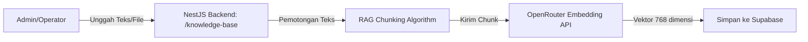

# Panduan Pengelolaan Basis Pengetahuan (Knowledge Base) AI

Dokumen ini menjelaskan cara mengelola dokumen peraturan daerah (Perda) dan basis pengetahuan lainnya di sistem **Genesis.id** agar dapat dibaca dan dicari oleh chatbot AI menggunakan RAG (Retrieval-Augmented Generation).

---

## 1. Aliran Data Pengelolaan Dokumen



---

## 2. Pengaturan RAG (Retrieval-Augmented Generation)

Anda dapat mengonfigurasi parameter pemotongan teks (*text chunking*) agar sesuai dengan kebutuhan kapasitas konteks model AI. Konfigurasi ini diatur melalui berkas `.env` pada server backend:

*   **`RAG_CHUNK_SIZE`**: Ukuran potongan teks (karakter). Default: `800`.
*   **`RAG_CHUNK_OVERLAP`**: Ukuran tumpang tindih antar potongan teks (karakter) agar konteks kalimat tidak terputus kasar di tengah-tengah. Default: `150`.

Contoh konfigurasi di `.env`:
```env
# Konfigurasi RAG Chunking
RAG_CHUNK_SIZE=800
RAG_CHUNK_OVERLAP=150
```

---

## 3. Cara Menambahkan Dokumen Baru secara Manual (API)

Penambahan dokumen dapat dilakukan melalui API Admin NestJS menggunakan JWT Token Admin Supabase.

### Endpoint: `POST /knowledge-base`
*   **Headers**: 
    - `Content-Type: application/json`
    - `Authorization: Bearer <supabase_jwt_admin_token>`
*   **Body Request**:
    ```json
    {
      "title": "Perda No. 9 Tahun 2021 tentang Pengelolaan Sampah",
      "content": "Pasal 1: Setiap warga wajib memisahkan sampah organik dan anorganik... [Teks Peraturan Sangat Panjang] ...",
      "metadata": {
        "category": "Sampah",
        "region": "Bandung"
      }
    }
    ```
*   **Response (201 Created)**:
    ```json
    {
      "message": "Document successfully split into 4 chunks and added to knowledge base",
      "documents": [
        {
          "id": "e6f827a5-c1e4-4d89-9a0f-15c2d3a4b5c6",
          "title": "Perda No. 9 Tahun 2021 tentang Pengelolaan Sampah - Bagian 1",
          "metadata": {
            "category": "Sampah",
            "region": "Bandung",
            "chunk_index": 0,
            "total_chunks": 4,
            "original_title": "Perda No. 9 Tahun 2021 tentang Pengelolaan Sampah"
          },
          "created_at": "2026-06-24T18:15:00.000Z"
        }
      ]
    }
    ```

---

## 4. Cara Unggah Dokumen Massal (Bulk Ingestion)

Untuk mengunggah berkas regulasi daerah dan nasional secara massal, kami menyediakan dua metode pengunggahan otomatis di direktori `backend/`:

### Metode A: Bulk Upload Berkas Lokal (`bulk-upload-knowledge.ts`)
1.  Kumpulkan berkas peraturan Anda (format `.txt` atau `.md`) di folder `docs/regulations/`.
2.  Buka terminal pada direktori `backend/` dan jalankan:
    ```bash
    npx ts-node scripts/bulk-upload-knowledge.ts ../docs/regulations "<supabase_service_role_key>" "http://localhost:3000"
    ```

---

### Metode B: Scraper JDIH & Importer Otomatis (`scrape-and-import-jdih.ts`)
Skrip ini mensimulasikan pencarian hukum ke portal **api.jdihn.go.id** (Jaringan Dokumentasi dan Informasi Hukum Nasional), mendownload berkas hukum nasional terbaru (PP No. 22/2021 tentang PPLH, Permen LHK No. 6/2021 tentang Limbah B3, UU No. 18/2013 tentang Pencegahan Perusakan Hutan), menyimpannya secara lokal, dan mengunggahnya secara batch ke API backend untuk dipecah (chunk) dan disimpan di Supabase:
```bash
npx ts-node scripts/scrape-and-import-jdih.ts "<supabase_service_role_key>" "http://localhost:3000"
```

---

## 4.1. Detail Arsitektur Integrasi API JDIHN Nasional (jdihn.go.id)
Untuk implementasi sistem produksi berskala besar, Genesis.id dirancang untuk berintegrasi langsung dengan portal nasional JDIHN yang dikelola oleh BPHN Kemenkumham. Berikut adalah standar pertukaran data API JDIHN yang dapat Anda gunakan:

1.  **Mekanisme Autentikasi**:
    *   **Protokol**: OAuth 2.0 (Client Credentials).
    *   **Endpoint Token**: `POST https://api.jdihn.go.id/v1/auth/token`
    *   **Payload**: `{ "client_id": "YOUR_JDIH_ID", "client_secret": "YOUR_SECRET_KEY" }`
    *   **Response**: `{ "access_token": "eyJhbGci...", "expires_in": 3600 }`

2.  **Pencarian & Penarikan Dokumen**:
    *   **Endpoint**: `POST https://api.jdihn.go.id/v1/produk-hukum/search`
    *   **Headers**: `Authorization: Bearer <access_token>`
    *   **Body JSON**:
        ```json
        {
          "tahun_terbit": 2021,
          "kategori": "Peraturan Pemerintah",
          "keyword": "Lingkungan Hidup",
          "page": 1,
          "limit": 10
        }
        ```
    *   **Response Data Schema (JSON)**:
        ```json
        {
          "status": "success",
          "data": [
            {
              "id": "jdih-pp-22-2021",
              "judul": "Peraturan Pemerintah Nomor 22 Tahun 2021...",
              "tipe_dokumen": "Peraturan Perundang-undangan",
              "jenis": "Peraturan Pemerintah",
              "singkatan_jenis": "PP",
              "nomor": "22",
              "tahun": "2021",
              "tanggal_penetapan": "2021-02-02",
              "url_download_pdf": "https://jdihn.go.id/files/pp-22-2021.pdf",
              "isi_teks": "[Teks penuh regulasi yang siap diekstraksi ke Markdown/RAG...]"
            }
          ]
        }
        ```

3.  **Ekstraksi Teks PDF**:
    Untuk file yang hanya menyediakan berkas PDF (tanpa field `isi_teks` JSON), pengembang dapat menggunakan pustaka Node.js seperti `pdf-parse` atau API pemrosesan dokumen OCR (seperti Google Document AI) di backend untuk mengubah PDF JDIH menjadi teks bersih sebelum dikirimkan ke `/knowledge-base` untuk embedding.


---

## 5. Cara Mengambil Daftar Dokumen

Untuk melihat daftar dokumen peraturan yang aktif di basis pengetahuan:

### Endpoint: `GET /knowledge-base`
*   **Headers**:
    - `Authorization: Bearer <supabase_jwt_admin_token>`
*   **Response (200 OK)**: Mengembalikan array data dokumen peraturan (mengecualikan kolom vektor `embedding` untuk menghemat memori transfer).

---

## 6. Cara Menghapus Dokumen

Untuk menghapus dokumen atau pecahan chunk tertentu dari basis pengetahuan:

### Endpoint: `DELETE /knowledge-base/:id`
*   **Headers**:
    - `Authorization: Bearer <supabase_jwt_admin_token>`
*   **Response (200 OK)**:
    ```json
    {
      "message": "Document successfully deleted"
    }
    ```

---

## 7. Algoritma RAG Chunking (Backend Details)

Di dalam `KnowledgeBaseService`, sebuah dokumen teks yang panjang akan secara otomatis dipotong menjadi bagian-bagian kecil (chunk) dengan aturan berikut:
1.  **Smart Spacing Alignment**: Pemotongan diusahakan mencari karakter spasi terdekat pada batas akhir potongan agar tidak memotong kata secara kasar.
2.  **Cosine Similarity RPC**: Pencarian kemiripan menggunakan RPC `match_documents` dengan ambang kemiripan minimal `0.35` dan mengembalikan maksimal `3` potongan konteks teratas ke prompt LLM.
