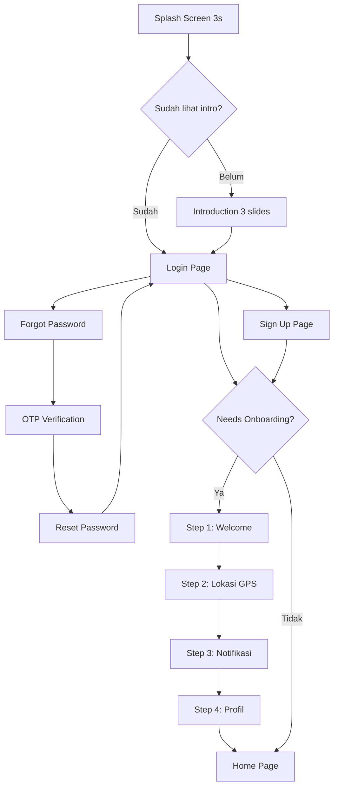

# Dokumentasi Arsitektur Mobile App Genesis.id (Flutter)

Dokumen ini memuat detail arsitektur tingkat tinggi (*high-level architecture*), struktur folder, modul data/repositori, konfigurasi jaringan, design system, navigasi, serta manajemen state untuk aplikasi mobile **Genesis.id** (Flutter).

---

## 1. Desain Arsitektur & Struktur Folder

Aplikasi mobile Genesis.id menerapkan pola **Clean Architecture** yang dikombinasikan dengan pembagian direktori **Feature-First** (Berbasis Fitur). Struktur ini memisahkan UI, logika bisnis, dan pemrosesan data secara terisolasi agar kode mudah dikembangkan, diuji, dan aman dari bug.

```
mobile/lib/
├── core/
│   ├── config/              # Konfigurasi proyek (Supabase credentials)
│   │   └── supabase_config.dart
│   ├── constants/           # Konstanta global (spacing, radius, durasi)
│   │   └── app_constants.dart
│   ├── errors/              # [NEW] Penanganan error terpusat
│   │   ├── app_exception.dart     # Sealed class hierarki (Network, Server, Auth, Device, Unexpected)
│   │   └── error_handler.dart     # Mapper: DioException/SocketException → AppException
│   ├── network/             # Koneksi HTTP kustom (Dio Client)
│   │   └── dio_client.dart
│   ├── router/              # Navigasi terpusat (GoRouter + redirect guard)
│   │   └── app_router.dart
│   ├── theme/               # Design System terpusat
│   │   ├── app_colors.dart       # Palet warna (Navy, Burgundy, Gold, Emerald)
│   │   ├── app_text_styles.dart  # Typography (Nunito + Plus Jakarta Sans)
│   │   ├── app_theme.dart        # ThemeData Material 3
│   │   └── app_decorations.dart  # BoxDecoration, shadow, gradient presets
│   ├── utils/               # Utilitas global
│   │   ├── validators.dart       # Form validators (email, password, username)
│   │   └── extensions.dart       # Dart extensions (context snackbar, string)
│   └── widgets/             # Widget reusable bermerek
│       ├── genesis_button.dart       # Tombol utama (primary, secondary, text)
│       ├── genesis_text_field.dart   # Input field (password toggle, validasi)
│       ├── genesis_loading.dart      # Loading indicator
│       ├── genesis_scaffold.dart     # Scaffold wrapper (SafeArea, gradient)
│       ├── genesis_error_widget.dart # [NEW] Fullscreen error + GenesisSnackBar extension
│       ├── auth_listener_wrapper.dart# [NEW] Centralized BlocListener untuk auth state
│       └── ios_button.dart          # iOS-style edge-to-edge button
└── features/
    ├── splash/              # Splash screen animasi
    │   └── presentation/
    │       ├── pages/splash_page.dart
    │       └── widgets/splash_logo.dart
    ├── introduction/        # 3-screen pengenalan fitur
    │   └── presentation/
    │       ├── pages/introduction_page.dart
    │       └── widgets/
    │           ├── intro_slide.dart
    │           └── intro_page_indicator.dart
    ├── auth/                # Autentikasi lengkap (5 halaman)
    │   ├── data/
    │   │   ├── datasources/auth_remote_data_source.dart
    │   │   └── repositories/auth_repository_impl.dart
    │   ├── domain/
    │   │   └── repositories/auth_repository.dart
    │   └── presentation/
    │       ├── bloc/              # AuthBloc (events, states)
    │       ├── pages/
    │       │   ├── login_page.dart
    │       │   ├── sign_up_page.dart
    │       │   ├── forgot_password_page.dart
    │       │   ├── otp_verification_page.dart
    │       │   └── reset_password_page.dart
    │       └── widgets/
    │           ├── auth_header.dart
    │           ├── social_sign_in_button.dart
    │           └── auth_footer_link.dart
    ├── setup/               # Post-login onboarding wizard (4 step)
    │   └── presentation/
    │       ├── bloc/
    │       │   ├── setup_cubit.dart
    │       │   └── setup_state.dart
    │       ├── pages/
    │       │   ├── setup_welcome_page.dart
    │       │   ├── setup_location_page.dart
    │       │   ├── setup_notification_page.dart
    │       │   └── setup_profile_page.dart
    │       └── widgets/
    │           ├── setup_progress_bar.dart
    │           └── setup_illustration.dart
    ├── home/                # Beranda utama
    │   └── presentation/pages/home_page.dart
    ├── profile/             # Profil user, streak, & badges
    │   ├── data/
    │   │   ├── datasources/profile_remote_data_source.dart
    │   │   ├── models/profile_model.dart & badge_model.dart
    │   │   └── repositories/profile_repository_impl.dart
    │   └── domain/repositories/profile_repository.dart
    ├── leaderboard/         # Papan peringkat global & wilayah kota
    │   ├── data/
    │   │   ├── datasources/leaderboard_remote_data_source.dart
    │   │   ├── models/
    │   │   └── repositories/
    │   └── domain/repositories/
    └── chat/           # Chatbot AI RAG warga (data source, model, BLoC)
```

### Struktur Aset

```
mobile/assets/
├── images/              # Ilustrasi statis
│   ├── intro/           # Gambar intro slides
│   ├── auth/            # Gambar halaman auth
│   └── setup/           # Gambar halaman setup wizard
├── icons/               # Ikon kustom (SVG/PNG)
└── animations/          # Animasi Lottie JSON
    ├── mascot/          # Maskot utama (wave, happy, sad)
    ├── achievements/    # Streak fire, level up, badge unlock, confetti
    └── transitions/     # Transisi halaman, loading globe
```

---

## 2. Design System

### A. Palet Warna

Warna dipilih secara deliberate berdasarkan tujuan psikologis:

| Kategori | Nama | Hex | Penggunaan |
|----------|------|-----|------------|
| **Primary (Navy)** | navy900 | `#0A1628` | Status bar, gradient gelap |
| | navy800 | `#0F2042` | AppBar, primary container |
| | navy700 | `#152D5C` | Tombol utama, CTA |
| | navy600 | `#1B3A76` | Link, secondary action |
| | navy100 | `#E8EDF5` | Subtle background |
| **Mascot (Burgundy)** | burgundy700 | `#800020` | Maskot primer |
| | burgundy500 | `#A3324B` | Aksen maskot |
| | burgundy100 | `#F5E0E5` | Background maskot area |
| **Accent** | gold | `#C8922A` | Badge, achievement, XP |
| | emerald | `#1B7A4E` | Sukses, streak, lingkungan |
| **Semantic** | error | `#C62828` | Validasi gagal |
| | warning | `#D4930A` | Status perhatian |
| **Surface** | surface | `#FAFAF8` | Background utama (warm) |
| | card | `#FFFFFF` | Card background |
| **Text** | textPrimary | `#1A1A2E` | Heading, body |
| | textSecondary | `#64748B` | Subtitle, hint |

### B. Typography

| Level | Font | Weight | Size | Penggunaan |
|-------|------|--------|------|------------|
| Display Large | Nunito | Bold | 32 | Splash title |
| Headline Large | Nunito | SemiBold | 24 | Page titles |
| Headline Medium | Nunito | SemiBold | 20 | Section headers |
| Body Large | Plus Jakarta Sans | Regular | 16 | Body text |
| Body Medium | Plus Jakarta Sans | Regular | 14 | Secondary text |
| Label Large | Plus Jakarta Sans | SemiBold | 16 | Button text |

**Nunito** dipilih untuk heading karena letterform bulat (soft, friendly). **Plus Jakarta Sans** dipilih untuk body karena readability tinggi dan berasal dari Indonesia.

---

## 3. Navigasi & Routing

Aplikasi menggunakan **GoRouter** terpusat di `core/router/app_router.dart`.

### Alur Navigasi



### Route Constants

Semua path route didefinisikan di `Routes` class untuk menghindari typo string:
- `/splash`, `/introduction`
- `/login`, `/sign-up`, `/forgot-password`, `/otp-verification`, `/reset-password`
- `/setup/welcome`, `/setup/location`, `/setup/notification`, `/setup/profile`
- `/home`

---

## 4. Lapisan Jaringan Terintegrasi (Dio Client & Supabase JWT)

All pemanggilan API kustom ke NestJS dialirkan melalui **DioClient** ([dio_client.dart](file:///d:/PROJECT%20ARIEF/LKS%20Dikdasmen/mobile/lib/core/network/dio_client.dart)).

*   **Otomatisasi Kredensial (Bearer Interceptor)**:
    DioClient menyuntikkan interceptor kustom yang memantau status sesi Supabase secara real-time. Jika pengguna memiliki sesi aktif, token JWT Supabase (`accessToken`) akan disisipkan secara otomatis sebagai `Authorization: Bearer <token>` pada setiap header HTTP request ke NestJS.
*   **Base URL**: Secara bawaan mengarah ke `http://10.0.2.2:3000` (IP localhost khusus untuk Emulator Android).

---

## 4.5. Penanganan Error Terpusat (Error Handling Architecture)

Aplikasi Genesis.id menerapkan penanganan error berlapis (multi-layer) agar setiap jenis kegagalan ditangani secara konsisten dan ramah pengguna.

### A. Global Error Catcher (`main.dart`)
Tiga lapisan perlindungan global dipasang di `main.dart`:
1. **`runZonedGuarded`** — Menangkap semua uncaught synchronous & asynchronous errors
2. **`FlutterError.onError`** — Menangkap error rendering/widget framework
3. **`PlatformDispatcher.instance.onError`** — Menangkap error Dart async yang lolos dari Zone
4. **Custom `ErrorWidget.builder`** — Menggantikan Red Screen of Death (RSOD) menjadi `GenesisErrorWidget` yang bersih dan bertema

### B. Hierarki AppException (`core/errors/app_exception.dart`)
Sealed class `AppException` dengan 5 subclass:

| Subclass | Contoh Trigger | Pesan Default |
|---|---|---|
| `NetworkException` | WiFi mati, timeout | "Tidak ada koneksi internet" |
| `ServerException` | HTTP 500, 503, 429 | "Server sedang bermasalah" |
| `AuthException` | HTTP 401, JWT expired | "Sesi Anda telah berakhir" |
| `DeviceException` | GPS denied, file error | "Izin perangkat diperlukan" |
| `UnexpectedException` | TypeError, fallback | "Terjadi kesalahan tak terduga" |

### C. ErrorHandler Mapper (`core/errors/error_handler.dart`)
Utilitas `ErrorHandler.handle(dynamic error)` yang mengkonversi error mentah ke `AppException`:
- `DioException.connectionTimeout` → `NetworkException`
- `DioException.badResponse(401)` → `AuthException`
- `DioException.badResponse(500)` → `ServerException`
- `SocketException` → `NetworkException`
- `FormatException` / `TypeError` → `UnexpectedException`

HTTP status code mapping:
- 400 → Bad Request, 401 → Session Expired, 403 → Forbidden
- 404 → Not Found, 429 → Rate Limited
- 500 → Internal Error, 503 → Maintenance

### D. Repository Layer Integration
Semua 4 repository implementation membungkus operasi dengan `try-catch` + `ErrorHandler.handle`:
- `AuthRepositoryImpl` — Auth operations
- `ProfileRepositoryImpl` — Profile & onboarding
- `LeaderboardRepositoryImpl` — Leaderboard queries
- `ReportRepositoryImpl` — Report submissions

### E. BLoC Layer Integration
Semua 3 BLoC menggunakan `ErrorHandler.handle` untuk pesan error user-friendly:
- `AuthBloc._parseError()` — Konversi error auth ke pesan UI
- `ReportsBloc` — Error saat submit/fetch laporan
- `ChatBloc.onError` — Error saat streaming chat

### F. GenesisErrorWidget (`core/widgets/genesis_error_widget.dart`)
Widget error premium fullscreen dengan:
- Ikon kontekstual (WiFi off, server down, auth expired)
- Tombol retry opsional
- Factory constructors: `.fromException()`, `.offline()`, `.serverDown()`, `.empty()`

### G. GenesisSnackBar (Extension on `BuildContext`)
Extension method terpusat di `genesis_error_widget.dart` yang menggantikan semua manual `ScaffoldMessenger.showSnackBar`:
- `context.showErrorSnackBar(message)` — Merah, ikon error
- `context.showSuccessSnackBar(message)` — Hijau emerald, ikon check
- `context.showWarningSnackBar(message)` — Kuning warning, ikon warning
- `context.showInfoSnackBar(message)` — Navy blue, ikon info

Semua SnackBar: floating, rounded, auto-dismiss, swipe-to-dismiss horizontal.

### H. AuthListenerWrapper (`core/widgets/auth_listener_wrapper.dart`)
Widget DRY yang menggantikan pola `BlocListener<AuthBloc, AuthState>` duplikat di 5+ halaman:
- Mendengarkan `Authenticated` → navigate ke setup/home
- Mendengarkan `AuthFailure` → `showErrorSnackBar`
- Menerima callback opsional `onAuthenticated` dan `onAuthFailure`

Halaman yang menggunakan `AuthListenerWrapper`:
- `LoginPage`, `SimpleSignInPage`, `SignUpPage`, `PreOnboardingPage`, `HomePage`

---

## 5. Implementasi Pemrosesan Data & Repositori

Setiap fitur memiliki lapisan data source yang terisolasi dengan baik:

### A. Autentikasi (Auth)
*   **AuthRemoteDataSource** ([auth_remote_data_source.dart](file:///d:/PROJECT%20ARIEF/LKS%20Dikdasmen/mobile/lib/features/auth/data/datasources/auth_remote_data_source.dart)):
    Menggunakan Supabase Dart SDK. Menangani:
    - Pendaftaran (`signUpWithEmailAndPassword`)
    - Login email/password (`signInWithEmailAndPassword`)
    - Google OAuth ID Token (`signInWithGoogle`)
    - Reset password (`resetPasswordForEmail`)
    - Verifikasi OTP (`verifyOtp`)
    - Update password (`updatePassword`)
*   **AuthRepositoryImpl** ([auth_repository_impl.dart](file:///d:/PROJECT%20ARIEF/LKS%20Dikdasmen/mobile/lib/features/auth/data/repositories/auth_repository_impl.dart)):
    Membungkus data source untuk menyediakannya ke lapisan presentasi.

### B. Profil & Lencana (Profile)
*   **ProfileModel** ([profile_model.dart](file:///d:/PROJECT%20ARIEF/LKS%20Dikdasmen/mobile/lib/features/profile/data/models/profile_model.dart)):
    Deserialisasi objek profil lengkap dari JSON (termasuk XP, Level, Streak, dan Lencana).
*   **ProfileRemoteDataSource** ([profile_remote_data_source.dart](file:///d:/PROJECT%20ARIEF/LKS%20Dikdasmen/mobile/lib/features/profile/data/datasources/profile_remote_data_source.dart)):
    Memanggil NestJS endpoint `/profiles/me` dan `/profiles/onboard`.

### C. Papan Peringkat (Leaderboard)
*   **LeaderboardRemoteDataSource** ([leaderboard_remote_data_source.dart](file:///d:/PROJECT%20ARIEF/LKS%20Dikdasmen/mobile/lib/features/leaderboard/data/datasources/leaderboard_remote_data_source.dart)):
    Memanggil NestJS endpoint `/leaderboard/global` and `/leaderboard/city` dengan opsi parameter `limit` terkonfigurasi.

### D. Pelaporan Spasial (Reports)
*   **ReportModel** ([report_model.dart](file:///d:/PROJECT%20ARIEF/LKS%20Dikdasmen/mobile/lib/features/reports/data/models/report_model.dart)) & **UploadReportResponse** ([upload_report_response.dart](file:///d:/PROJECT%20ARIEF/LKS%20Dikdasmen/mobile/lib/features/reports/data/models/upload_report_response.dart)):
    Deserialisasi data laporan (PostGIS POINT GeoJSON/WKT) dan status unggahan/duplikat dari NestJS.
*   **ReportRemoteDataSource** ([report_remote_data_source.dart](file:///d:/PROJECT%20ARIEF/LKS%20Dikdasmen/mobile/lib/features/reports/data/datasources/report_remote_data_source.dart)):
    Mengirimkan multipart request berisi file gambar, latitude, longitude, dan deskripsi ke NestJS.
*   **ReportRepositoryImpl** ([report_repository_impl.dart](file:///d:/PROJECT%20ARIEF/LKS%20Dikdasmen/mobile/lib/features/reports/data/repositories/report_repository_impl.dart)):
    Menjembatani akses data laporan ke presentation layer.

### E. Chatbot AI Warga (Chat)
*   **ChatMessageModel** ([chat_message_model.dart](file:///d:/PROJECT%20ARIEF/LKS%20Dikdasmen/mobile/lib/features/chat/data/models/chat_message_model.dart)):
    Menyimpan riwayat pesan, pengirim (`user`/`bot`), lampiran base64 (gambar, PDF, audio), dan timestamp.
*   **ChatRemoteDataSource** ([chat_remote_data_source.dart](file:///d:/PROJECT%20ARIEF/LKS%20Dikdasmen/mobile/lib/features/chat/data/datasources/chat_remote_data_source.dart)):
    Menghubungi endpoint `/chat/stream` NestJS, melakukan decoding bytes chunk stream UTF-8, dan mem-parsing Server-Sent Events (SSE) secara real-time.

---

## 6. Manajemen State & Alur Onboarding (Auth & Chat BLoC)

### A. Autentikasi & Onboarding (Auth BLoC)
State management autentikasi diatur secara ketat menggunakan **`flutter_bloc`**:

State management autentikasi diatur secara ketat menggunakan **`flutter_bloc`**:

### Events
*   `AuthCheckRequested` — Cek status autentikasi saat app dimulai
*   `SignInRequested` — Login email/password
*   `SignUpRequested` — Registrasi akun baru
*   `GoogleSignInRequested` — Login via Google OAuth
*   `SignOutRequested` — Logout
*   `ForgotPasswordRequested` — Kirim email reset password
*   `VerifyOtpRequested` — Verifikasi kode OTP
*   `ResetPasswordRequested` — Set password baru

### States
*   `AuthInitial` — State awal
*   `AuthLoading` — Sedang memproses
*   `Authenticated(user, needsOnboarding)` — Terautentikasi
*   `Unauthenticated` — Belum terautentikasi
*   `AuthFailure(errorMessage)` — Gagal
*   `PasswordResetEmailSent(email)` — Email reset terkirim
*   `OtpVerified` — OTP terverifikasi
*   `PasswordResetSuccess` — Password berhasil diubah

### Logika Onboarding
Saat status berubah menjadi `Authenticated`, BLoC memanggil `ProfileRepository.getMyProfile()` untuk mendeteksi apakah data `cityOrDistrict` masih kosong.
*   Jika **kosong (NULL)**: `Authenticated` dipancarkan dengan flag `needsOnboarding: true`. UI Flutter mengarahkan user ke Setup Wizard (4 langkah).
*   Jika **berisi**: `Authenticated` dipancarkan dengan flag `needsOnboarding: false`. UI Flutter langsung mengarahkan user ke beranda utama.

### Setup Wizard Cubit
Post-login setup menggunakan **`SetupCubit`** (lebih sederhana dari Bloc) untuk mengelola 4 langkah:
1. **Welcome** — Pengenalan proses setup
2. **Location** — GPS permission + reverse geocoding
3. **Notification** — Push notification permission
4. **Profile** — Username + nama lengkap → submit ke `POST /profiles/onboard`

> **Catatan Arsitektur**: `SetupCubit` di-scope ke `ShellRoute` lokal di `AppRouter` (bukan global `MultiBlocProvider`). Cubit ini hanya hidup selama 4 halaman setup wizard dan otomatis di-dispose setelah user selesai onboarding. Ini mencegah memory leak dan memastikan state setup tidak bocor ke halaman lain.

### B. Chatbot AI Warga (ChatBloc)
Mengelola riwayat pesan dan pemrosesan asinkronus (streaming) dari OpenRouter:
*   **Events**:
    *   `SendMessageRequested(message)` — Mengirim pesan (teks/media) ke backend, menempelkan placeholder balasan bot kosong, dan mendengarkan stream.
    *   `ClearChatRequested` — Menghapus riwayat obrolan dan menutup koneksi stream aktif.
    *   `_StreamChunkReceived(chunk)` *(Internal)* — Menerima potongan karakter teks dari SSE dan mengakumulasikannya ke bubble pesan bot aktif.
    *   `_StreamCompleted` *(Internal)* — Aliran data selesai, mengubah isStreaming ke false.
    *   `_StreamFailed(error)` *(Internal)* — Menampilkan pesan kesalahan.
*   **States**:
    *   `ChatState(messages, isStreaming, errorMessage)` — Menyimpan daftar seluruh chat history (`messages`), indikator loading/streaming (`isStreaming`), dan error jika ada.

---

## 7. Standar Clean Code Dart di Genesis.id

1.  **Strict Type Safety**: Menghindari tipe data `dynamic` pada parsing JSON atau properti data. Menggunakan class model terdefinisi (`ProfileModel`, `BadgeModel`). Safe cast untuk route extras.
2.  **Immutability**: Semua model data dan state dideklarasikan menggunakan properti `final` untuk mencegah perubahan data yang tidak sengaja. State menggunakan `Equatable` + `copyWith`.
3.  **Dependency Injection**: Repositori disuntikkan (*injected*) ke konstruktor BLoC secara eksplisit untuk mempermudah pembuatan mock unit test.
4.  **No Magic Numbers**: Semua spacing, durasi, dan ukuran didefinisikan di `AppConstants`.
5.  **Design System Terpusat**: Semua warna di `AppColors`, typography di `AppTextStyles`, dekorasi di `AppDecorations` — tidak ada styling ad-hoc.
6.  **Form Validation Konsisten**: Validator di `core/utils/validators.dart` selaras dengan aturan DTO backend NestJS.
7.  **Widget Reusable**: Tombol (`GenesisButton`, `IosButton`), input (`GenesisTextField`), loading (`GenesisLoading`), error (`GenesisErrorWidget`) — tidak ada duplikasi styling.
8.  **Error Handling Terpusat**: Semua error di-mapping via `ErrorHandler.handle()` → `AppException`. Tidak ada `catch` kosong. Semua pesan error user-friendly ditampilkan via `GenesisSnackBar` extension.
9.  **DRY Auth Listener**: Pola `BlocListener<AuthBloc, AuthState>` terpusat di `AuthListenerWrapper` — tidak ada duplikasi listener di setiap halaman auth.
10. **Relative Imports**: Semua import internal menggunakan path relatif, bukan `package:mobile/...`.
11. **Memory Safety**: `TextEditingController` selalu di-dispose. Dialog controllers di-dispose via `.then()` callback. State cubit di-scope ke route lifecycle.
12. **Null Safety Defensive**: Model `fromJson()` menggunakan fallback value untuk field nullable (contoh: `createdAt ?? ''`).
13. **Global Error Boundary**: `ErrorWidget.builder` override di `main.dart` mencegah Red Screen of Death — digantikan `GenesisErrorWidget` bertema.
