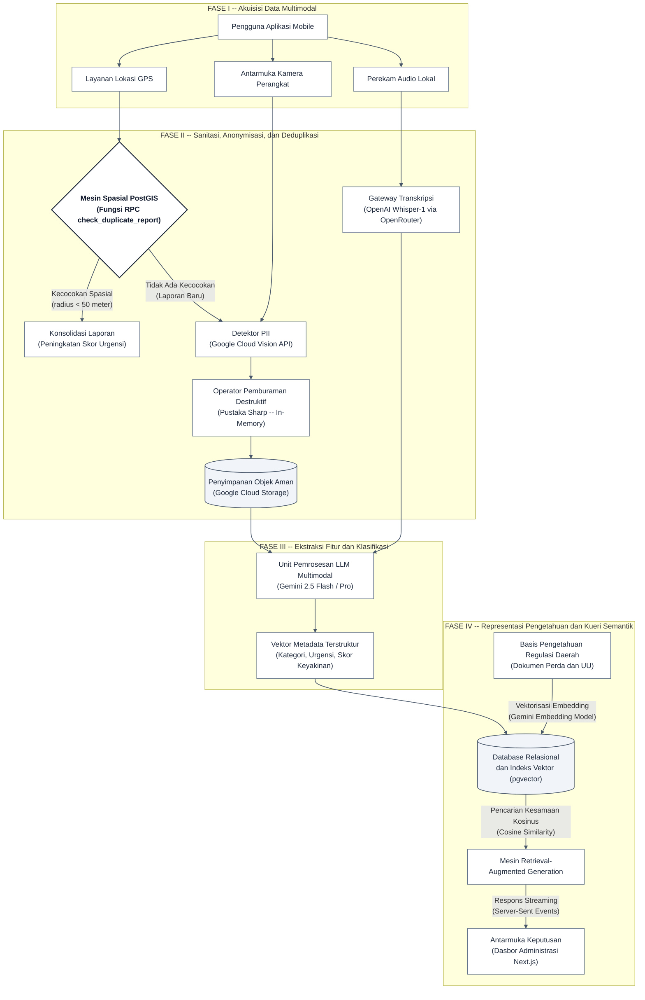
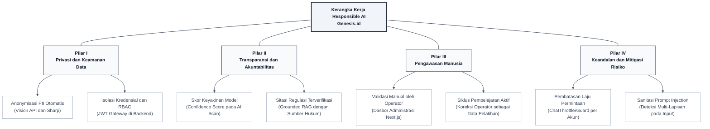

# 1.4 Pendekatan Teknis dan Sumber Data

Sebagaimana telah diuraikan pada Subbab 1.1, tantangan utama dalam pengelolaan informasi lingkungan di Indonesia bukan lagi terletak pada kemampuan mengumpulkan data, melainkan pada kemampuan membangun proses pembentukan pengetahuan secara berkelanjutan. Untuk menjawab tantangan tersebut, Genesis.id mengadopsi pendekatan teknis yang dirancang melalui tiga prinsip arsitektural: (1) pemisahan tanggung jawab antar komponen sistem, (2) pengolahan data sebagai siklus umpan balik bertingkat, dan (3) pembentukan representasi pengetahuan semantik dari akumulasi data partisipasi publik.

Sistem dibangun di atas arsitektur multi-platform dengan tiga komponen utama. Komponen pertama adalah server backend berbasis NestJS dengan adapter Fastify yang berfungsi sebagai gerbang pemrosesan data berkecepatan tinggi. Komponen kedua adalah dasbor administrasi berbasis Next.js yang memfasilitasi pengawasan, validasi, dan analisis data oleh operator manusia. Komponen ketiga adalah aplikasi warga berbasis Flutter yang mengimplementasikan arsitektur bersih (*Clean Architecture*) dengan pemisahan lapisan data, domain, dan presentasi, serta manajemen status berbasis pola BLoC (*Business Logic Component*).

Alur teknis pengolahan data dirancang sebagai *pipeline* bertingkat yang terdiri dari empat fase sekuensial. Setiap fase menjalankan fungsi transformasi spesifik terhadap data masukan sebelum meneruskannya ke fase berikutnya:

**Gambar 1.** Diagram alur pemrosesan data Genesis.id dari fase akuisisi hingga pembentukan pengetahuan.

---

### A. Katalog Sumber Data

Sistem memproses lima kategori data utama yang berasal dari dua domain: data dinamis hasil partisipasi aktif masyarakat dan data statis berupa regulasi pemerintah daerah.

| No. | Kategori | Format | Sumber | Fungsi dalam Sistem |
|:---:|:---|:---|:---|:---|
| 1 | Data Spasial | Koordinat GPS (lat, lng) | Sensor lokasi perangkat mobile | Klasterisasi geografis dan validasi kedekatan laporan melalui PostGIS |
| 2 | Data Visual | Berkas citra (JPEG/PNG) | Kamera perangkat mobile | Ekstraksi fitur visual untuk identifikasi jenis dan volume material sampah |
| 3 | Data Audio | Rekaman suara (M4A) | Mikrofon perangkat mobile | Transkripsi otomatis menjadi deskripsi naratif melalui Whisper STT |
| 4 | Data Regulasi | Dokumen teks (PDF/Markdown) | Repositori peraturan daerah | Basis referensi legal untuk validasi rekomendasi melalui pencarian semantik |
| 5 | Data Historis | Skema relasional SQL | Database PostgreSQL (Supabase) | Deteksi pola dan tren permasalahan berulang pada wilayah tertentu |

**Tabel 1.** Klasifikasi sumber data berdasarkan format, asal, dan peran fungsional.

---

### B. Uraian Tahapan Pemrosesan Data

#### Fase I: Akuisisi Data Multimodal

Proses dimulai pada lapisan klien melalui aplikasi Flutter. Warga dapat menyampaikan laporan lingkungan dalam tiga modalitas input secara simultan: (a) foto objek permasalahan yang diambil langsung dari kamera perangkat keras, (b) rekaman suara berformat M4A yang direkam menggunakan pustaka `record` untuk memberikan deskripsi verbal tanpa keterbatasan kemampuan menulis, serta (c) koordinat lokasi GPS yang diperoleh secara otomatis melalui integrasi pustaka `geolocator`. Data dari ketiga modalitas tersebut dikirimkan secara asinkron ke server backend melalui protokol HTTP *multipart/form-data*.

#### Fase II: Sanitasi, Anonymisasi, dan Deduplikasi

Fase ini menjalankan tiga proses sanitasi berurutan sebelum data disimpan secara permanen.

**Pertama**, deduplikasi spasial. Server mengeksekusi fungsi RPC `check_duplicate_report` pada database PostgreSQL yang didukung ekstensi PostGIS. Fungsi ini menghitung jarak geodesik (*great-circle distance*) menggunakan tipe data `geography` untuk mendeteksi laporan aktif dalam radius 50 meter dan jendela waktu 12 jam. Apabila ditemukan kecocokan, sistem melakukan konsolidasi ke dalam entitas laporan yang telah ada tanpa menduplikasi berkas citra.

**Kedua**, anonymisasi informasi sensitif. Citra mentah diproses secara *in-memory* melalui modul PII Redaction Service yang memanggil Google Cloud Vision API dengan dua detektor: `faceDetection` untuk mengidentifikasi koordinat piksel wajah manusia dan `textDetection` untuk mengidentifikasi plat nomor kendaraan. Koordinat area terdeteksi kemudian diburamkan secara destruktif menggunakan pustaka Sharp dengan operasi *Gaussian blur* yang bersifat *irreversible*, sehingga data PII tidak dapat dipulihkan kembali setelah proses pemburaman.

**Ketiga**, transkripsi audio. Berkas rekaman suara dikirimkan ke endpoint `/chat/transcribe` untuk dikonversi menjadi teks menggunakan model OpenAI Whisper-1 melalui gateway API OpenRouter, menghasilkan deskripsi naratif yang memperkaya konteks pelaporan.

#### Fase III: Ekstraksi Fitur dan Klasifikasi

Citra yang telah melalui proses anonymisasi dan tersimpan di Google Cloud Storage dievaluasi melalui endpoint `/reports/analyze` menggunakan model multimodal Gemini 2.5 Flash. Model melakukan ekstraksi fitur visual dan mengembalikan payload JSON terstruktur yang memuat empat komponen informasi: (a) kategori material sampah berdasarkan klasifikasi organik, anorganik, B3, atau elektronik; (b) tingkat urgensi penanganan pada skala rendah, sedang, atau tinggi; (c) skor keyakinan (*confidence score*) yang merepresentasikan tingkat kepastian prediksi model; serta (d) rekomendasi operasional awal berupa langkah mitigasi yang sesuai dengan jenis material teridentifikasi.

Apabila skor keyakinan melebihi ambang batas 85%, sistem secara otomatis menyetujui laporan dan memicu pemberian penghargaan gamifikasi kepada pelapor. Apabila skor berada di bawah ambang batas tersebut, laporan dialihkan ke status `pending_human` untuk ditinjau secara manual oleh operator.

#### Fase IV: Representasi Pengetahuan dan Kueri Semantik

Fase terakhir mengintegrasikan data laporan terstruktur dengan basis pengetahuan regulasi daerah melalui arsitektur Retrieval-Augmented Generation (RAG). Dokumen regulasi dipecah menjadi fragmen teks (*chunking*), dikonversi menjadi vektor embedding 768 dimensi menggunakan model Gemini Embedding, dan diindeks menggunakan algoritma HNSW (*Hierarchical Navigable Small World*) pada ekstensi `pgvector` di PostgreSQL.

Ketika pengguna atau administrator mengajukan pertanyaan, sistem mengonversi pertanyaan tersebut menjadi vektor kueri, lalu melakukan pencarian kesamaan kosinus terhadap indeks vektor untuk mengambil tiga fragmen regulasi paling relevan. Fragmen konteks tersebut digabungkan dengan riwayat percakapan dan instruksi sistem, lalu dikirimkan ke model LLM (Gemini 2.5 Flash atau Pro) untuk menghasilkan jawaban yang didasarkan pada regulasi daerah yang sah. Respons dikirimkan ke klien secara real-time melalui protokol Server-Sent Events (SSE).

Melalui mekanisme ini, setiap informasi yang masuk ke dalam sistem tidak berhenti sebagai entitas data yang berdiri sendiri, melainkan saling terhubung dan memperkaya basis pengetahuan kolektif yang dapat diakses oleh seluruh pemangku kepentingan.

---

# 1.5 Responsible AI

Penerapan kecerdasan artifisial pada Genesis.id dirancang dengan mengacu pada prinsip-prinsip etika AI yang bertanggung jawab. Prinsip ini tidak diimplementasikan sebagai lapisan tambahan di atas sistem, melainkan ditanamkan sejak tahap perancangan arsitektur (*Safety by Design*). Kerangka kerja Responsible AI Genesis.id dibangun di atas empat pilar utama:

**Gambar 2.** Kerangka kerja empat pilar Responsible AI pada arsitektur Genesis.id.

---

### Pilar I: Privasi dan Keamanan Data

Perlindungan privasi warga diterapkan sejak data berada pada tahap transmisi pertama, mengikuti prinsip *Privacy by Design*.

Pada aspek anonymisasi, setiap citra laporan diproses melalui pipeline sensor PII sebelum disimpan ke penyimpanan awan. Google Cloud Vision API mendeteksi koordinat piksel wajah manusia dan plat nomor kendaraan bermotor secara otomatis. Seluruh proses pemburaman dilakukan di dalam memori RAM server menggunakan pustaka Sharp tanpa menulis berkas sementara ke penyimpanan lokal, sehingga data PII mentah tidak pernah tersimpan secara persisten di infrastruktur mana pun.

Pada aspek pengelolaan kredensial, kunci akses tingkat tinggi seperti Service Role Key yang memiliki kemampuan melewati kebijakan keamanan baris (*Row Level Security*) disimpan secara eksklusif di berkas konfigurasi lingkungan server backend dan tidak pernah didistribusikan ke sisi klien. Akses data dilindungi melalui mekanisme Role-Based Access Control (RBAC) yang membedakan hak akses berdasarkan peran pengguna (`citizen` dan `admin`) melalui verifikasi token JWT pada setiap permintaan.

### Pilar II: Transparansi dan Akuntabilitas

Setiap keluaran yang dihasilkan oleh komponen kecerdasan artifisial disertai dengan mekanisme penjelasan yang memungkinkan pengguna menilai keandalan informasi secara mandiri.

Hasil klasifikasi AI Scan menyertakan skor keyakinan (*confidence score*) yang merepresentasikan tingkat kepastian model terhadap prediksinya. Metrik ini ditampilkan secara eksplisit kepada pengguna untuk mengkomunikasikan bahwa setiap prediksi AI bersifat probabilistik dan memiliki margin kesalahan tertentu.

Jawaban yang dihasilkan oleh asisten Geni AI melalui arsitektur RAG didasarkan secara ketat pada fragmen dokumen regulasi daerah yang tersimpan di basis pengetahuan. Setiap respons menyertakan rujukan pasal atau dokumen sumber yang relevan, sehingga pengguna dapat memverifikasi keabsahan informasi secara independen. Pendekatan *grounded generation* ini secara signifikan memitigasi risiko halusinasi informasi yang umum terjadi pada model bahasa besar.

### Pilar III: Pengawasan Manusia

Sistem kecerdasan artifisial pada Genesis.id diposisikan sebagai instrumen pendukung keputusan (*decision-support system*), bukan sebagai agen otonom yang menggantikan pertimbangan manusia.

Setiap laporan warga yang dianalisis oleh modul AI Scan dan memperoleh skor keyakinan di bawah ambang batas 85% dialihkan ke status `pending_human` dan memerlukan peninjauan manual oleh operator administrasi melalui dasbor Next.js. Operator memiliki kewenangan penuh untuk menyetujui, mengubah klasifikasi, atau menolak laporan berdasarkan penilaian profesionalnya.

Koreksi yang dilakukan oleh operator terhadap hasil klasifikasi AI bukan hanya berfungsi sebagai tindakan administratif, melainkan juga berperan sebagai mekanisme pembelajaran aktif (*active learning feedback loop*). Setiap koreksi disimpan kembali ke database dan dapat dimanfaatkan sebagai dataset berlabel baru untuk meningkatkan akurasi model pada iterasi pengembangan berikutnya.

### Pilar IV: Keandalan dan Mitigasi Risiko

Sistem menerapkan mekanisme pertahanan berlapis untuk menjaga ketersediaan layanan dan mencegah penyalahgunaan infrastruktur AI.

**Pembatasan laju permintaan.** Endpoint yang mengonsumsi sumber daya komputasi intensif, seperti transkripsi audio Whisper dan interaksi chatbot Geni AI, dilindungi oleh middleware `ChatThrottlerGuard` yang membatasi jumlah permintaan per menit berdasarkan identitas akun pengguna. Mekanisme ini mencegah lonjakan biaya penggunaan token API sekaligus melindungi server dari serangan *Denial of Service*.

**Sanitasi input multi-lapisan.** Seluruh data teks yang masuk ke sistem, baik dari input langsung maupun hasil transkripsi audio, dilewatkan melalui modul sanitasi yang menerapkan empat teknik deteksi: (a) deteksi *character-spaced evasion* yang mengidentifikasi kata kunci berbahaya yang dipisahkan oleh spasi; (b) deteksi *encoding-based evasion* yang mendekode input heksadesimal dan Base64 untuk mengungkap instruksi tersembunyi; (c) deteksi *typoglycemia* yang mengenali kata kunci yang diacak urutan hurufnya; serta (d) redaksi otomatis yang menggantikan konten berbahaya terdeteksi dengan token `[PROMPT_INJECTION]` sebelum diteruskan ke model bahasa. Pendekatan pertahanan berlapis ini memastikan bahwa upaya manipulasi instruksi sistem (*prompt injection*), ujaran kebencian, maupun konten yang melanggar norma dapat dideteksi dan dicegah secara komprehensif.
