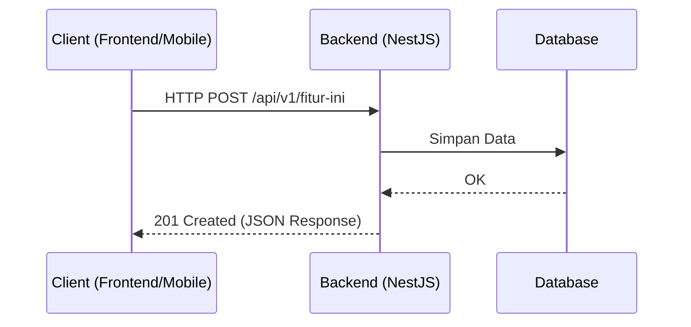

# Template Dokumentasi Fitur: [Nama Fitur]

Dokumen ini menjelaskan spesifikasi bisnis, alur data, kontrak API, dan detail implementasi untuk fitur **[Nama Fitur]**. Gunakan template ini setiap kali menambahkan fitur baru.

---

## 1. Deskripsi Bisnis (Requirements)
*Jelaskan apa tujuan fitur ini, siapa penggunanya, dan bagaimana cara kerjanya secara garis besar.*

- **User Story**: 
  - Sebagai [peran], saya ingin [tindakan] sehingga [manfaat].
- **Kriteria Penerimaan (Acceptance Criteria)**:
  - [ ] Kriteria 1
  - [ ] Kriteria 2

---

## 2. Alur Data (Flow Diagram)
*Tuliskan diagram alur sederhana menggunakan sintaks Mermaid jika diperlukan.*



---

## 3. Kontrak API (API Contract)
*Definisikan endpoint API yang dibutuhkan untuk fitur ini.*

### A. Endpoint 1: [Nama Aksi]
- **Method & Path**: `POST /api/v1/resource`
- **Autentikasi**: Ya/Tidak (Bearer Token)
- **Request Body (JSON)**:
  ```json
  {
    "nama_properti": "string",
    "angka": 123
  }
  ```
- **Response (201 Created)**:
  ```json
  {
    "id": "uuid-string",
    "nama_properti": "string",
    "angka": 123,
    "createdAt": "2026-06-21T09:00:00Z"
  }
  ```

---

## 4. Panduan Implementasi Komponen

### A. Backend (NestJS)
- **DTO**: Buat `Create[Feature]Dto` dan gunakan `class-validator` untuk memvalidasi input.
- **Service**: Implementasikan logika bisnis di `[feature].service.ts`.
- **Entity/Database**: [Nama tabel database yang digunakan].

### B. Frontend (Next.js)
- **Page Route**: `/halaman-fitur`
- **Komponen**: `[Feature]Form`, `[Feature]List`.
- **Hooks**: Buat custom hook `useCreate[Feature]` menggunakan TanStack Query (React Query) dan panggil Client API hasil generate OpenAPI.

### C. Mobile (Flutter)
- **Widget**: `[Feature]Screen`, `[Feature]FormWidget`.
- **State Management**: Buat `[Feature]Bloc` atau `[Feature]Notifier`.
- **Model**: Gunakan model hasil generate `swagger_parser` (`[Feature]Model`).
