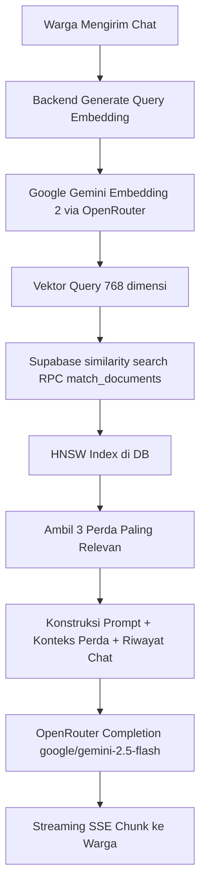

# Fitur 5: Chatbot AI Warga Terintegrasi RAG & OpenRouter

Fitur ini memungkinkan warga untuk berinteraksi dengan asisten pintar AI guna mendapatkan penjelasan dan jawaban seputar peraturan daerah (perda), regulasi resmi kota, dan prosedur administrasi secara santun, cepat, dan akurat menggunakan pendekatan RAG (Retrieval-Augmented Generation).

---

## 1. Arsitektur RAG (Retrieval-Augmented Generation)

Sistem chatbot dirancang dengan alur RAG dinamis untuk mencegah halusinasi AI:



---

## 2. Struktur Database Supabase

Kami memanfaatkan ekstensi `vector` pada Supabase (PostgreSQL) dengan indeksasi HNSW untuk performa pencarian kemiripan kosinus:

```sql
-- Tabel penampung dokumen regulasi resmi
CREATE TABLE public.knowledge_base (
    id UUID PRIMARY KEY DEFAULT gen_random_uuid(),
    title TEXT NOT NULL,
    content TEXT NOT NULL,
    embedding VECTOR(768) NOT NULL, -- Sesuai dimensi output gemini-embedding-2
    metadata JSONB DEFAULT '{}'::jsonb,
    created_at TIMESTAMP WITH TIME ZONE DEFAULT now() NOT NULL
);

-- Indeks HNSW untuk kecepatan kueri spasial vektor kosinus
CREATE INDEX knowledge_base_embedding_hnsw_idx 
ON public.knowledge_base 
USING hnsw (embedding vector_cosine_ops);
```

Fungsi RPC `match_documents` dipanggil di backend untuk mencocokkan kemiripan dokumen secara matematis:
$$\text{Similarity} = 1 - \text{Cosine Distance}(A, B)$$

---

## 3. Kontrak API Backend

### A. Endpoint Obrolan Publik (Citizen)

*   **POST** `/chat` (Instan) / **POST** `/chat/stream` (Streaming SSE)
*   **Headers**: `Authorization: Bearer <supabase_jwt_token>`
*   **Body Request**:
    ```json
    {
      "message": "Bagaimana aturan denda membuang sampah sembarangan?",
      "model": "google/gemini-2.5-pro",
      "image": "data:image/jpeg;base64,...",
      "pdf": "data:application/pdf;base64,...",
      "audio": "data:audio/wav;base64,..."
    }
    ```
*   **Streaming SSE Chunk Format**:
    ```
    data: {"choices": [{"delta": {"content": "Menurut "}}]}
    data: {"choices": [{"delta": {"content": "Perda "}}]}
    ...
    data: [DONE]
    ```

### B. Endpoint Pengelolaan Dokumen (Admin Only)

Diperlukan untuk menghubungkan Next.js Admin Dashboard agar admin dapat mengelola basis pengetahuan AI:

*   **GET** `/knowledge-base` : Menampilkan daftar dokumen.
*   **POST** `/knowledge-base` : Menambahkan perda baru (otomatis menghasilkan embedding).
*   **DELETE** `/knowledge-base/:id` : Menghapus dokumen regulasi.

---

## 4. Mekanisme Pengamanan & Clean Code

1.  **Rate Limiting**: `ChatThrottlerGuard` membatasi request chat maksimal 10 request per menit untuk role `citizen` berbasis in-memory. Role `admin` bebas dari throttling.
2.  **Validasi Payload Size**: Pembatasan string base64 (`image`, `pdf`, `audio`) maksimal 5MB per parameter untuk mencegah kehabisan memori server (*out-of-memory DoS*).
3.  **Sanitasi Prompt Injection**: Menyaring input teks warga secara lokal di backend sebelum dikirim ke OpenRouter. Kami menerapkan deteksi evasion komprehensif:
    *   **Character-Spaced Evasion**: Menghapus spasi ganda/karakter terpisah (contoh: `i g n o r e`) lalu memindainya kembali.
    *   **Encoding-Based Evasion**: Mendekode teks Hex (beruntun maupun dipisahkan spasi seperti `69 67 6e 6f 72 65`) dan teks Base64 untuk memastikan instruksi jahat tidak disembunyikan dalam encoding.
    *   **Typoglycemia (Fuzzy Targets)**: Mendeteksi kata kunci yang diacak huruf tengahnya (contoh: `ignroe` -> `ignore`, `systme` -> `system`, `frotget` -> `forget`).
    *   **Redaksi Otomatis**: Konten berbahaya yang terdeteksi secara otomatis diredaksi menjadi `[PROMPT_INJECTION]` agar aman diteruskan ke LLM tanpa merusak/menghentikan percakapan warga.

### C. Endpoint Transkripsi Audio (Whisper STT)

*   **POST** `/chat/transcribe`
*   **Headers**: `Authorization: Bearer <supabase_jwt_token>`
*   **Body Request**:
    ```json
    {
      "audio": "data:audio/m4a;base64,...",
      "format": "m4a"
    }
    ```
*   **Response**:
    ```json
    {
      "text": "Hasil transkripsi teks dari suara warga."
    }
    ```

---

## 5. Verifikasi & Pengujian Streaming (SSE)

Kami telah memverifikasi secara langsung fungsionalitas dari server streaming API OpenRouter dengan model `google/gemini-2.5-flash` melalui skrip pengujian [test_openrouter_stream.js](file:///C:/Users/arief/.gemini/antigravity/brain/5d19354b-3bf1-42bf-bfc4-06f605652364/scratch/test_openrouter_stream.js).

### Hasil Pengujian Script:
- **Koneksi Streaming Berhasil**: Server streaming merespons dengan header dan status `200 OK`.
- **Pengiriman Chunk Berurutan**: Chunk data (SSE format `data: {...}`) diterima satu demi satu secara real-time dan didekode dengan sangat cepat.
- **Konfirmasi**: Pengujian mengonfirmasi bahwa client seluler (Flutter) menerima respons asisten AI secara streaming asinkron tanpa hambatan untuk memberikan visualisasi ketik dinamis mirip ChatGPT.
