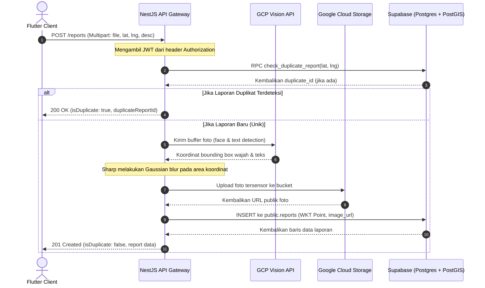

# Dokumentasi Fitur: Pelaporan Spasial, GCS, & Sensor Gambar PII (Fitur 3)

Dokumen ini menjelaskan spesifikasi bisnis, alur data, kontrak API, dan detail implementasi untuk fitur **Pelaporan Masalah Lingkungan Spasial (Crowdsourcing)** yang dilengkapi dengan integrasi Google Cloud Storage (GCS) dan penyensoran data sensitif (PII Redaction) menggunakan AI.

---

## 1. Deskripsi Bisnis (Requirements)

Fitur ini memungkinkan masyarakat (Citizen) melaporkan masalah lingkungan (seperti penumpukan sampah liar, limbah industri, pencemaran air) melalui foto dan lokasi koordinat GPS secara real-time. Untuk menjaga kualitas laporan dan privasi, sistem menerapkan aturan keamanan serta pencegahan spam otomatis.

- **User Story**: 
  - Sebagai **Citizen** (Warga), saya ingin mengirimkan laporan berupa foto langsung dari kamera, koordinat GPS, dan deskripsi masalah lingkungan agar instansi berwenang/masyarakat tahu adanya titik pencemaran.
  - Sebagai **Sistem/Admin**, saya ingin secara otomatis menyensor wajah orang dan plat nomor kendaraan di foto sebelum disimpan ke cloud (GCS) demi mematuhi kebijakan privasi data (PII).
  - Sebagai **Sistem/Admin**, saya ingin memfilter laporan ganda yang dikirim dalam radius berdekatan (<50 meter) dalam kurun waktu singkat (<12 jam) agar tidak terjadi spam pelaporan di titik yang sama.

- **Kriteria Penerimaan (Acceptance Criteria)**:
  - [x] Laporan wajib menyertakan file foto, `latitude`, dan `longitude`.
  - [x] Deteksi wajah dan plat nomor kendaraan diproses oleh Google Cloud Vision API secara in-memory.
  - [x] Sharp menerapkan efek Gaussian blur (keburaman tinggi) pada area terdeteksi sebelum foto diunggah ke Google Cloud Storage.
  - [x] Database menyimpan koordinat GPS menggunakan tipe data spasial PostGIS `geometry(Point, 4326)`.
  - [x] Jika terdeteksi laporan ganda di lokasi yang sama dalam radius 50m dan waktu 12 jam, sistem mengembalikan status duplikat tanpa menduplikasi data foto di GCS.

---

## 2. Alur Data (Flow Diagram)



---

## 3. Kontrak API (API Contract)

### A. Endpoint 1: Unggah Laporan Baru (Multipart/Form-Data)
- **Method & Path**: `POST /reports`
- **Autentikasi**: Ya (Bearer JWT Citizen)
- **Request Body (Multipart)**:
  - `file`: Berkas gambar/foto (format `.jpg`, `.jpeg`, `.png`, dll).
  - `latitude`: String/Desimal koordinat lintang (contoh: `-6.2088`).
  - `longitude`: String/Desimal koordinat bujur (contoh: `106.8456`).
  - `description`: String deskripsi laporan (opsional).

- **Response 1: Sukses Membuat Laporan Baru (201 Created)**:
  ```json
  {
    "isDuplicate": false,
    "message": "Laporan berhasil diunggah dan disimpan",
    "report": {
      "id": "7a752b09-5a5f-4a37-b6e5-23091176b6d2",
      "reporter_id": "4b68db6e-219d-4e9b-b0b2-29ee1a67a84c",
      "image_url": "https://storage.googleapis.com/genesis-bucket/reports/4b68db6e/1718942391_x8d2f.jpg",
      "description": "Tumpukan sampah plastik menyumbat saluran air di dekat pasar.",
      "location": "SRID=4326;POINT(106.8456 -6.2088)",
      "status": "pending_ai",
      "confidence_score": 0.0,
      "waste_type": null,
      "danger_level": null,
      "created_at": "2026-06-21T10:39:51.000Z",
      "updated_at": "2026-06-21T10:39:51.000Z"
    }
  }
  ```

- **Response 2: Laporan Duplikat Terdeteksi (200 OK)**:
  ```json
  {
    "isDuplicate": true,
    "message": "Laporan serupa terdeteksi dalam radius 50 meter. Menggabungkan laporan...",
    "duplicateReportId": "9c1221b2-132d-4560-93bf-4375b42d131f"
  }
  ```

### B. Endpoint 2: Dapatkan Daftar Semua Laporan (JSON)
- **Method & Path**: `GET /reports`
- **Autentikasi**: Ya (Bearer JWT)
- **Response (200 OK)**:
  ```json
  [
    {
      "id": "7a752b09-5a5f-4a37-b6e5-23091176b6d2",
      "reporter_id": "4b68db6e-219d-4e9b-b0b2-29ee1a67a84c",
      "image_url": "https://storage.googleapis.com/genesis-bucket/reports/4b68db6e/1718942391_x8d2f.jpg",
      "description": "Tumpukan sampah plastik menyumbat saluran air.",
      "location": {
        "type": "Point",
        "coordinates": [106.8456, -6.2088]
      },
      "status": "pending_ai",
      "confidence_score": 0.0,
      "waste_type": null,
      "danger_level": null,
      "created_at": "2026-06-21T10:39:51.000Z",
      "updated_at": "2026-06-21T10:39:51.000Z",
      "profiles": {
        "username": "warga_peduli",
        "full_name": "Ahmad Warga",
        "avatar_url": "https://supabase.co/storage/v1/object/public/avatars/ahmad.jpg"
      }
    }
  ]
  ```

---

## 4. Panduan Implementasi Komponen

### A. Database (Postgres + PostGIS)
- **Tabel**: `public.reports`
- **Indeks Spasial**: `CREATE INDEX reports_location_idx ON public.reports USING GIST(location);`
- **Fungsi Spasial (`check_duplicate_report`)**:
  Fungsi SQL Pl/pgSQL menggunakan `ST_DWithin` untuk memeriksa koordinat masukan terhadap baris aktif dengan parameter toleransi `0.00045` derajat (~50 meter) dalam kurun waktu `12 hours`.

### B. Backend (NestJS)
- **Controller**: [ReportsController](file:///d:/PROJECT%20ARIEF/LKS%20Dikdasmen/backend/src/reports/reports.controller.ts)
  - Mengamankan endpoint dengan `AuthGuard`.
  - Mengekstrak file buffer via `req.file()` dari `@fastify/multipart`.
  - Menyediakan endpoint admin terlindungi `PATCH /reports/:id` dan `DELETE /reports/:id`.
- **Service**: [ReportsService](file:///d:/PROJECT%20ARIEF/LKS%20Dikdasmen/backend/src/reports/reports.service.ts)
  - Mengoordinasikan panggilan ke DB RPC, pemrosesan sensor PII, unggahan ke GCS, dan penulisan baris baru.
  - Memicu task klasifikasi AI di latar belakang secara asinkronus setelah laporan berhasil disimpan.
  - Memverifikasi status saat admin melakukan pembaruan laporan. Jika diubah menjadi `approved`, memicu pemberian reward gamifikasi.
- **AI Classification**: [AiClassificationService](file:///d:/PROJECT%20ARIEF/LKS%20Dikdasmen/backend/src/reports/ai-classification.service.ts)
  - Berintegrasi dengan Google Gen AI SDK (`@google/genai`) untuk menganalisis gambar laporan menggunakan model `gemini-1.5-flash` / `gemini-2.5-flash` dengan luaran schema JSON.
  - Menerapkan aturan persetujuan otomatis (Confidence Score > 85% & isValid = true) dan otomatis memberikan +100 XP, kenaikan level, streak, serta mendeteksi lencana baru.
  - Mengarahkan laporan dengan tingkat keyakinan rendah atau tidak valid ke status `pending_human` atau `rejected`.
- **Privacy Redactor**: [PiiRedactionService](file:///d:/PROJECT%20ARIEF/LKS%20Dikdasmen/backend/src/storage/pii-redaction.service.ts)
  - Berintegrasi dengan `@google-cloud/vision` untuk mendeteksi wajah (`faceDetection`) dan teks/plat kendaraan (`textDetection`).
  - Menggunakan pustaka `sharp` untuk melakukan Gaussian blur di koordinat terdeteksi secara in-memory.

### C. Mobile (Flutter)
- **Model**:
  - [ReportModel](file:///d:/PROJECT%20ARIEF/LKS%20Dikdasmen/mobile/lib/features/reports/data/models/report_model.dart): Deserialisasi JSON respons, mampu membaca format data spasial GeoJSON maupun WKT.
  - [UploadReportResponse](file:///d:/PROJECT%20ARIEF/LKS%20Dikdasmen/mobile/lib/features/reports/data/models/upload_report_response.dart): Menangani properti status duplikat.
- **Remote Data Source**: [ReportRemoteDataSourceImpl](file:///d:/PROJECT%20ARIEF/LKS%20Dikdasmen/mobile/lib/features/reports/data/datasources/report_remote_data_source.dart)
  - Mengonversi File gambar dan koordinat GPS menjadi `FormData` multipart sebelum dikirimkan ke Dio client.
- **Repository**: [ReportRepositoryImpl](file:///d:/PROJECT%20ARIEF/LKS%20Dikdasmen/mobile/lib/features/reports/data/repositories/report_repository_impl.dart)
  - Abstraksi interaksi data untuk presentation layer.
- **State Management**: [ReportsBloc](file:///d:/PROJECT%20ARIEF/LKS%20Dikdasmen/mobile/lib/features/reports/presentation/bloc/reports_bloc.dart)
  - Mengelola event `UploadReportRequested` dan `FetchReportsRequested` serta memancarkan loading, success, atau failure state.
