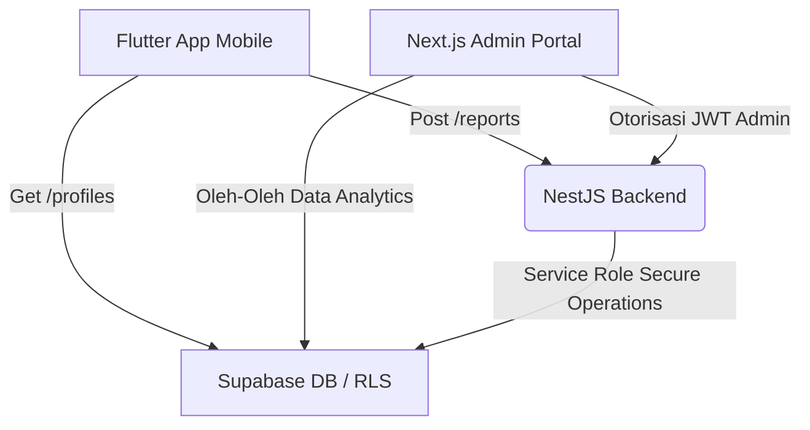

# Genesis.id Web Portal & Dashboard (Next.js)

[](#)
[](#)
[](#)
[](#)

Aplikasi Web Frontend **Genesis.id** dibangun menggunakan **Next.js App Router** (TypeScript, React, & TailwindCSS). Bagian ini berfungsi sebagai etalase publik (Landing Page), dasbor analitik interaktif bagi instansi pemerintah (DaaS), serta portal administrasi/moderator komprehensif bagi admin untuk memoderasi data geospasial lingkungan secara real-time.

---

## 🛑 Aturan Keamanan & Integritas Data (Mandatory)

1. **Zero Dummy Data Policy (Anti-Data Palsu):**
   Saat dasbor beralih ke **Live API Mode**, aplikasi melarang keras fallback diam-diam (*silent fallback*) ke dataset tiruan. Jika koneksi backend terputus, dasbor akan mengosongkan state lokal, menghentikan render data mock, dan menampilkan banner kesalahan koneksi premium (*Failed to Connect HUD*) agar administrator mengetahui status real-time infrastruktur server secara transparan.
2. **Keamanan Kunci Rahasia:**
   `SUPABASE_SERVICE_ROLE_KEY` **TIDAK BOLEH** diletakkan atau dibaca di sisi frontend browser. Semua tindakan pengelolaan lencana sensitif (`POST /badges/award`, `DELETE /badges/revoke`) atau penghapusan profil pengguna wajib disalurkan melalui rute aman server backend NestJS yang memvalidasi otorisasi JWT Admin.

---

## 1. Komponen Utama & Fitur Unggulan

### A. Landing Page & Publikasi
Halaman pemasaran modern, responsif, dan dinamis yang memperkenalkan platform crowdsourcing Genesis.id kepada masyarakat umum, dilengkapi tombol unduh aplikasi mobile (Flutter) serta statistik lingkungan regional.

### B. Admin Moderator Panel (Dashboard Admin)
Panel kendali mutakhir untuk administrator mengelola seluruh ekosistem Genesis.id dengan fitur-fitur:
1. **Dasbor Ringkasan Analitik (Overview Tab):**
   * Menyajikan metrik penting: *Total Laporan*, *Antrean Validasi*, *Warga Aktif*, dan *Akurasi Vision-AI*.
   * Bagan batang (*Bar Chart*) interaktif kecepatan penanganan laporan harian.
   * Bagan donat (*Donut Chart*) proporsi sebaran status laporan (Ditangani, Antrean AI, Validasi Manual, Ditolak) yang terhubung 100% ke array database.
   * Tabel **Pelaporan Spasial Terkini** yang memuat data laporan asli secara real-time (bukan data karyawan tiruan), lengkap dengan rincian tipe sampah, tingkat bahaya, akurasi AI, status, dan tombol aksi "Tinjau".
2. **Theme Engine (Light & Dark Mode):**
   * Transisi tema premium antara **Vibrant Light Theme** (utama) dan **Ultra Dark Theme** (`#0a0915` aesthetic dengan *neon glowing ambient circles*).
   * Preferensi tema disimpan secara aman di LocalStorage browser (`admin_theme`) dan secara otomatis disinkronkan saat admin masuk ke dalam sesi dasbor.
3. **AI Assistant Drawer (Asisten AI Marhas):**
   * Laci interaktif (*Sliding Drawer Overlay*) yang dipicu dari bar navigasi atas.
   * Asisten AI ini mampu membaca metrik operasional secara langsung dari memori state aktif (mengetahui jumlah eksak laporan masuk, jumlah warga terdaftar, dokumen regulasi aktif, serta laporan tertunda) untuk memberikan statistik akurat tanpa tebakan.
4. **Moderasi Laporan & Lokasi Geospasial (Reports Tab):**
   * Pemetaan spasial interaktif menggunakan Leaflet Map dengan ubin peta lembut (*Soft Voyager map tiles*) yang menyesuaikan mode terang/gelap.
   * Modul verifikasi aman dilengkapi dengan modal konfirmasi ganda sebelum melakukan tindakan destruktif.
   * Penanganan pembaruan status terotomatisasi yang menyelaraskan payload DTO frontend (status `'resolved'`) ke format backend NestJS (status `'approved'`).
5. **Kontrol Mutlak Warga & Gamifikasi (Profiles Tab):**
   * Manajemen warga lengkap dengan aksi ban/unban yang tersinkronisasi.
   * Koreksi manual data gamifikasi (XP, Level, Streak) dan pemberian/pencabutan lencana (*Badges*) langsung ke profile target.
6. **AI Knowledge Base / RAG Panel (RagTab):**
   * Antarmuka administrasi dokumen hukum. Admin dapat mengunggah file regulasi/perda baru (otomatis ter-chunking dan ter-embedding di database vektor Supabase), membaca konten teks penuh, dan menghapus dokumen dengan validasi kata kunci keamanan.

---

## 2. Struktur Proyek Web

```
frontend/
├── public/                 # Aset statis, ikon, sitemap.xml, sitemap-static.xml
└── src/
    ├── app/                # Next.js App Router
    │   ├── admin/          # Dasbor Admin Panel & Halaman Login Otoritas
    │   │   ├── components/ # Sub-komponen tab isolasi (Overview, Reports, Profiles, dll.)
    │   │   └── login/      # Form otentikasi login admin JWT
    │   ├── api-portal/     # Portal dokumentasi API terbuka (DaaS Swagger UI)
    │   └── page.tsx        # Landing Page utama publik
    ├── components/         # Komponen global UI bersama
    └── utils/              # Client fetcher, pemetaan URL backend, & Supabase integration
```

---

## 3. Setup & Jalankan Lokal

### Prasyarat
* Node.js versi 18 ke atas
* NPM atau Yarn

### Langkah Instalasi
1. Masuk ke direktori `frontend`:
   ```bash
   cd frontend
   ```
2. Instal seluruh dependensi proyek:
   ```bash
   npm install
   ```
3. Konfigurasikan berkas `.env.local` pada akar folder frontend:
   ```env
   NEXT_PUBLIC_SUPABASE_URL=https://your-supabase-url.supabase.co
   NEXT_PUBLIC_SUPABASE_ANON_KEY=your-supabase-anon-key
   ```
4. Jalankan server pengembangan lokal:
   ```bash
   npm run dev
   ```
5. Buka peramban pada alamat `http://localhost:3000`.

---

## 4. Proses Build & Produksi

Untuk melakukan kompilasi proyek Next.js sebelum disebarkan ke lingkungan produksi:
```bash
npm run build
```
Hasil build yang optimal dan ter-minify akan diekspor ke direktori `.next/` dan siap disajikan melalui server produksi dengan perintah:
```bash
npm run start
```

---

## 5. Hubungan dengan Sub-Proyek Lain


* **Read Operations:** Dasbor admin membaca database Supabase menggunakan client-side fetching yang dikombinasikan dengan API NestJS demi performa analitik secepat kilat.
* **Write Operations (Administrative Actions):** Untuk menjaga keamanan kunci rahasia (*secret role bypass*), semua penulisan atau pengubahan data sensitif dikirimkan sebagai permintaan berotorisasi JWT ke server backend NestJS di `https://genesisHub.my.id`.
