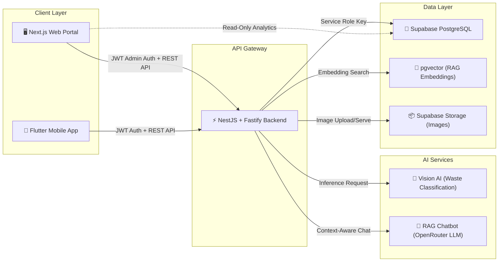

<div align="center">

# 🌍 Genesis.id — Web Portal & Admin Dashboard

**Platform Crowdsourcing Lingkungan Cerdas Berbasis AI**

[](https://nextjs.org/)
[](https://react.dev/)
[](https://www.typescriptlang.org/)
[](https://tailwindcss.com/)

[](https://genesisHub.web.id)
[](https://genesisHub.my.id)
[](#)

<br/>

> *"Menghubungkan warga, pemerintah, dan kecerdasan buatan dalam satu ekosistem pengelolaan lingkungan yang transparan, terukur, dan real-time."*

---

[Arsitektur](#-arsitektur-sistem) · [Fitur](#-fitur-unggulan) · [Quickstart](#-quickstart) · [Deployment](#-deployment--docker) · [Keamanan](#-kebijakan-keamanan) · [SEO](#-seo--web-vitals) · [Tim](#-tim--kontribusi)

</div>

---

## 📐 Arsitektur Sistem



### Tech Stack

| Layer | Teknologi | Keterangan |
|:------|:----------|:-----------|
| **Framework** | Next.js 16 (App Router) | Server & Client Components, Turbopack |
| **UI Library** | React 19 | Concurrent features, Server Actions |
| **Language** | TypeScript 5 (Strict Mode) | Zero tolerance terhadap tipe `any` |
| **Styling** | TailwindCSS 4.3 + Custom Design Tokens | Glassmorphism, Neon Glow, Ambient Lighting |
| **Icons** | Lucide React | 1500+ SVG icons, tree-shakeable |
| **Maps** | Leaflet + CartoDB Voyager Tiles | Pemetaan geospasial interaktif |
| **Typography** | Geist Sans & Geist Mono (Google Fonts) | Font premium eksklusif Vercel |
| **Charts** | Custom SVG (Bar + Donut) | 100% terhubung ke array database live |
| **SEO** | JSON-LD Schema, OpenGraph, Sitemap | Google Search Console terverifikasi |
| **Deployment** | Docker (Multi-stage Alpine) | Non-root container, standalone output |

---

## ✨ Fitur Unggulan

### 🏠 Landing Page Publik

Halaman pemasaran responsif yang dirancang untuk mengedukasi warga tentang platform crowdsourcing lingkungan Genesis.id. Dilengkapi video background dinamis, statistik lingkungan real-time, dan tombol unduh aplikasi mobile.

**Routes Publik:**

| Route | Deskripsi |
|:------|:----------|
| `/` | Hero section, value proposition, CTA download |
| `/features` | Showcase fitur AI classification & gamifikasi |
| `/solutions` | Solusi smart city untuk pemerintah daerah |
| `/services` | Layanan DaaS (Data-as-a-Service) API |
| `/contact` | Formulir kontak & informasi tim |
| `/docs` | Dokumentasi API interaktif (OpenAPI/Swagger) |

---

### 🛡️ Admin Dashboard — Moderator Command Center

Panel administrasi komprehensif dengan **8 modul operasional**, seluruhnya terintegrasi langsung ke database Supabase PostgreSQL melalui NestJS Backend API.

#### Navigasi Sidebar Terstruktur

Menu dikelompokkan ke dalam 3 kategori agar admin tidak kebingungan:

```
┌─────────────────────────────────┐
│  DASBOR & KONTROL               │
│  ├─ 📊 Ringkasan Analitik       │
│  ├─ 📍 Laporan Spasial     [3]  │  ← Badge jumlah antrean validasi
│  └─ 👥 Kontrol Warga            │
│                                 │
│  SIARAN & GAMIFIKASI            │
│  ├─ 🏆 Pusat Tantangan          │
│  └─ 📢 Pusat Siaran             │
│                                 │
│  AI & KEAMANAN                  │
│  ├─ 📄 Basis Pengetahuan AI     │
│  └─ 📋 Log Audit Sistem         │
└─────────────────────────────────┘
```

---

#### 📊 Tab 1 — Ringkasan Analitik (Overview)

Dashboard utama yang menampilkan kesehatan operasional seluruh platform dalam satu pandangan.

| Komponen | Sumber Data | Keterangan |
|:---------|:------------|:-----------|
| **4 Metric Cards** | `reports[]`, `profiles[]` | Total Laporan, Antrean Validasi, Warga Aktif, Akurasi Vision-AI |
| **Bar Chart** | `reports[]` (index-bucketed) | Kecepatan penanganan laporan per hari (7 hari) dengan tooltip hover HUD |
| **Donut Chart** | `reports[]` (status filter) | Proporsi: Ditangani · Antrean AI · Validasi Manual · Ditolak |
| **Tabel Laporan Terkini** | `reports[]` (sorted desc, top 5) | ID, Reporter, Waste Type, Danger Level, AI Confidence, Status, Date, Action |

> **⚠️ Zero Dummy Policy:** Semua angka metrik menampilkan nilai `0` jika database kosong — bukan angka placeholder palsu.

---

#### 📍 Tab 2 — Laporan Spasial (Reports)

Moderasi laporan lingkungan crowdsource dari seluruh wilayah dengan visualisasi peta interaktif.

- **Leaflet Map** — Menampilkan pin koordinat laporan dengan popup detail
- **Search & Filter** — Pencarian teks bebas + filter status (Semua / Pending / Approved / Rejected)
- **Detail Drawer** — Slide panel untuk melihat foto sampah, deskripsi AI, dan koordinat GPS
- **Aksi Moderasi** — Approve ✅ / Reject ❌ / Delete 🗑️ dengan **modal konfirmasi wajib**
- **Batch Actions** — Approve All Pending / Reject All Pending secara massal
- **Status DTO Mapping** — Frontend `'resolved'` → Backend `'approved'` (otomatis)

---

#### 👥 Tab 3 — Kontrol Warga (Profiles)

Manajemen penuh atas seluruh akun warga terdaftar dengan kemampuan administratif tingkat tinggi.

- **Pencarian Warga** — Filter berdasarkan nama, username, atau kota
- **Detail Profil** — Avatar, XP, Level, Streak, Kota, Provinsi, Tanggal bergabung
- **🏅 Award / Revoke Badge** — Berikan atau cabut lencana dari profil warga
- **🎮 Adjust Gamification** — Koreksi manual XP, Level, dan Streak via modal input
- **🚫 Ban / Unban** — Larang akses warga secara langsung
- **🗑️ Delete Profile** — Hapus akun dengan **dialog konfirmasi** (bukan `window.confirm`)
- **➕ Create Badge** — Buat lencana kustom baru (kode, judul, deskripsi)

---

#### 📄 Tab 4 — Basis Pengetahuan AI (RAG Knowledge Base)

Kelola dokumen regulasi hukum yang menjadi sumber referensi chatbot RAG di aplikasi mobile.

- **Daftar Dokumen** — Judul, Kategori, Jumlah Karakter, Tanggal Upload
- **📖 Reading Drawer** — Baca konten teks penuh dokumen secara inline
- **➕ Tambah Dokumen** — Upload regulasi baru (otomatis chunking + embedding ke pgvector)
- **🗑️ Hapus Dokumen** — Memerlukan input teks konfirmasi keamanan (`HAPUS`)
- **Font Legibility** — Font besar dan jelas untuk keterbacaan optimal dokumen hukum

---

#### 🏆 Tab 5 — Pusat Tantangan (Challenges & Events)

Pengelolaan tantangan gamifikasi dan event resmi yang mendorong partisipasi warga.

- **Challenges** — Buat, lihat, dan hapus tantangan XP/Points
- **Official Events** — Kelola event komunitas (kerja bakti, festival green)
- **Modal konfirmasi** wajib sebelum penghapusan

---

#### 📢 Tab 6 — Pusat Siaran (Broadcast Center)

Kirim notifikasi broadcast ke seluruh warga atau kelompok target tertentu.

- **Compose Broadcast** — Judul, Pesan, Kategori (Alert/Info/Event), Target
- **Broadcast History** — Log riwayat siaran terkirim

---

#### 📋 Tab 7 — Log Audit Sistem (Audit Trail)

Rekam jejak setiap tindakan administratif untuk transparansi dan akuntabilitas.

- **Action Logging** — LOGIN, REPORT_UPDATE, PROFILE_DELETE, BADGE_AWARD, dll.
- **Immutable Timeline** — Tidak bisa dihapus, hanya bisa dilihat
- **Detail Granular** — Admin name, action type, detail, timestamp ISO

---

### 🎨 Theme Engine — Dual Mode System

| | Light Mode (Default) | Dark Mode |
|:--|:---------------------|:----------|
| **Background** | `bg-surface` / White | `#0a0915` Ultra Dark |
| **Cards** | White + Navy borders | `#111026` + Indigo borders |
| **Sidebar** | White/80 glassmorphism | `#0b0a1a/95` deep space |
| **Accents** | Navy-900, Indigo-600 | Violet-500, `#a78bfa` neon |
| **Ambient** | Subtle navy/gold blur | Neon purple/gold glow circles |

Preferensi tema tersimpan di `localStorage('admin_theme')` dan langsung tersinkronkan saat login.

---

### 🤖 AI Assistant — Asisten Marhas

Laci interaktif (*sliding drawer*) yang menampilkan chatbot AI bawaan dengan kemampuan:

- Membaca **metrik real-time** langsung dari state aktif dashboard
- Menjawab pertanyaan seperti *"Berapa laporan masuk?"* dengan angka database aktual
- Menyediakan statistik: Total Laporan, Warga Terdaftar, Dokumen Regulasi, Laporan Tertunda

---

## 🔐 Kebijakan Keamanan

### Data Integrity — Zero Dummy Data Policy

```
┌──────────────────────────────────────────────────────┐
│                  LIVE MODE ACTIVE                     │
│                                                      │
│  ✅ API Success  →  Render data dari PostgreSQL       │
│  ❌ API Failure  →  Clear ALL state arrays to []      │
│                     Set connectionError state         │
│                     Show "Failed to Connect" banner   │
│                     ❌ NEVER fallback to mock data     │
│                                                      │
│  🔄 SIMULATOR MODE  →  Use localStorage emulator     │
│                        Mock data ONLY in this mode   │
└──────────────────────────────────────────────────────┘
```

### Secret Key Protection

| Rule | Detail |
|:-----|:-------|
| `SUPABASE_SERVICE_ROLE_KEY` | **HANYA** di `.env` server NestJS backend |
| Browser exposure | **DILARANG KERAS** — tidak ada service key di client |
| Sensitive operations | Dialirkan melalui JWT-authenticated NestJS endpoints |
| Admin auth | JWT token disimpan di `localStorage('genesis_admin_token')` |

### RBAC (Role-Based Access Control)

```
citizen  →  Flutter mobile app (read/write own data)
admin    →  Next.js dashboard (full administrative control)
```

Rute admin dilindungi oleh `@Roles('admin')` + `RolesGuard` di backend NestJS.

---

## 🚀 Quickstart

### Prasyarat

| Tool | Versi Minimum |
|:-----|:-------------|
| Node.js | ≥ 18.0 |
| npm | ≥ 9.0 |

### Instalasi & Jalankan

```bash
# 1. Clone repository
git clone https://github.com/agissugandi7203-ops/EKKA-2026_MarhasAI.git
cd EKKA-2026_MarhasAI/frontend

# 2. Install dependencies
npm install

# 3. Konfigurasi environment
cp .env.example .env.local
```

Edit `.env.local`:
```env
NEXT_PUBLIC_SUPABASE_URL=https://your-project.supabase.co
NEXT_PUBLIC_SUPABASE_ANON_KEY=eyJ...your-anon-key
```

```bash
# 4. Jalankan development server
npm run dev

# 5. Buka browser
# → http://localhost:3000          (Landing Page)
# → http://localhost:3000/admin    (Admin Dashboard)
```

### NPM Scripts

| Script | Perintah | Keterangan |
|:-------|:---------|:-----------|
| `dev` | `npm run dev` | Development server dengan hot reload (Turbopack) |
| `build` | `npm run build` | Kompilasi optimized production bundle |
| `start` | `npm run start` | Jalankan production server |
| `lint` | `npm run lint` | ESLint code quality check |

---

## 🐳 Deployment — Docker

Dockerfile menggunakan **multi-stage build** dengan keamanan non-root container:

```bash
# Build image
docker build -t genesis-frontend .

# Run container
docker run -p 3000:3000 \
  -e NEXT_PUBLIC_SUPABASE_URL=https://your-project.supabase.co \
  -e NEXT_PUBLIC_SUPABASE_ANON_KEY=your-anon-key \
  genesis-frontend
```

<details>
<summary>📄 <strong>Dockerfile Architecture</strong></summary>

```dockerfile
# Stage 1: Builder (node:20-alpine)
# - npm ci (clean install)
# - npm run build (optimized production bundle)

# Stage 2: Runner (node:20-alpine)
# - Non-root user (nextjs:nodejs, UID 1001)
# - Standalone output only (~100MB vs ~500MB full)
# - Exposed on port 3000
```

</details>

---

## 🔍 SEO & Web Vitals

| Aspek | Implementasi |
|:------|:-------------|
| **Meta Tags** | Title, Description, Keywords per halaman |
| **OpenGraph** | `og:title`, `og:description`, `og:url`, `og:type` |
| **Twitter Cards** | `summary_large_image` |
| **JSON-LD** | Schema.org `Organization` structured data |
| **Sitemap** | `/sitemap.xml` — 6 routes terindeks |
| **Robots** | `/robots.txt` — allow all crawlers |
| **Google Verification** | `googlee4a64ab1a21f7c0d.html` |
| **Canonical URL** | `https://genesisHub.web.id` |

---

## 📁 Struktur Proyek

```
frontend/
├── public/
│   ├── sitemap.xml              # Sitemap dinamis (6 routes)
│   ├── robots.txt               # Crawler directives
│   ├── manifest.json            # PWA manifest
│   ├── schema-org.json          # Structured data
│   ├── googlee4a64ab1a21f7c0d.html  # Google Search Console
│   └── videos/                  # Background video assets
│
├── src/
│   ├── app/
│   │   ├── layout.tsx           # Root layout (Geist fonts, SEO metadata, JSON-LD)
│   │   ├── globals.css          # Design tokens & utility classes
│   │   ├── page.tsx             # Landing Page publik
│   │   │
│   │   ├── admin/
│   │   │   ├── page.tsx         # 🧠 Admin Dashboard Controller (1360 lines)
│   │   │   │                    #    State management, fetchData, handlers,
│   │   │   │                    #    theme engine, AI drawer, connection error
│   │   │   ├── login/
│   │   │   │   └── page.tsx     # JWT authentication form
│   │   │   └── components/
│   │   │       ├── Sidebar.tsx       # Grouped navigation (3 categories)
│   │   │       ├── OverviewTab.tsx   # Analytics dashboard (charts + metrics)
│   │   │       ├── ReportsTab.tsx    # Geospatial reports + Leaflet map
│   │   │       ├── ProfilesTab.tsx   # User management + gamification
│   │   │       ├── RagTab.tsx        # AI Knowledge Base (RAG documents)
│   │   │       ├── ChallengesTab.tsx # Gamification challenges & events
│   │   │       ├── BroadcastTab.tsx  # Notification broadcast center
│   │   │       └── AuditTab.tsx      # System audit trail log
│   │   │
│   │   ├── contact/             # Contact page
│   │   ├── docs/                # API documentation portal
│   │   ├── features/            # Feature showcase page
│   │   ├── services/            # DaaS services page
│   │   └── solutions/           # Smart city solutions page
│   │
│   └── components/
│       ├── Header.tsx           # Global navigation header
│       └── BoomerangVideoBg.tsx # Dynamic video background component
│
├── Dockerfile                   # Multi-stage production build
├── tailwind.config.ts           # TailwindCSS configuration
├── tsconfig.json                # TypeScript strict mode config
├── next.config.ts               # Next.js configuration
└── package.json                 # Dependencies & scripts
```

---

## 🔗 Integrasi Multi-Platform

Genesis.id beroperasi sebagai **tiga sub-proyek** yang saling terhubung:

| Sub-Proyek | Teknologi | Domain | Peran |
|:-----------|:----------|:-------|:------|
| **Frontend** (ini) | Next.js 16 | `genesisHub.web.id` | Portal publik + Admin dashboard |
| **Backend** | NestJS + Fastify | `genesisHub.my.id` | REST API, JWT auth, RBAC, AI inference |
| **Mobile** | Flutter + Dio + BLoC | Google Play Store | Aplikasi warga (laporan, chatbot, gamifikasi) |

### Alur Data

```
Warga (Flutter) ──POST /reports──→ NestJS ──→ Vision AI classify
                                      │          ↓
                                      │     Supabase DB (insert)
                                      │          ↓
Admin (Next.js) ←── GET /reports ─────┘     AI confidence < 70%?
       │                                        ↓
       │                                 status = 'pending_human'
       │                                        ↓
       └─── PATCH /reports/:id ──────→ Admin approve/reject
                                        ↓
                                  XP + Badge awarded to reporter
```

---

## 👥 Tim & Kontribusi

<table>
  <tr>
    <td align="center"><b>Genesis.id — MarhasAI Team</b></td>
  </tr>
  <tr>
    <td align="center">
      LKS Dikdasmen Nasional 2026<br/>
      <i>IT Software Solution for Business</i>
    </td>
  </tr>
</table>

---

<div align="center">

**Built with ❤️ using Next.js, React, TypeScript, and TailwindCSS**

`genesisHub.web.id` · `genesisHub.my.id`

</div>
